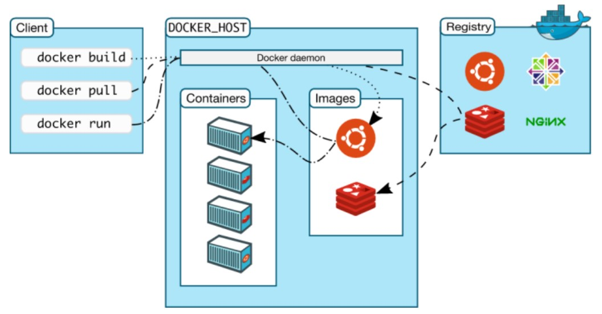

# `container` and `Docker`  basics

- [`container` and `Docker`  basics](#-container--and--docker---basics)
  * [Intuition](#intuition)
    + [`container`](#-container-)
    + [`Docker`](#-docker-)
    + [`Docker Daemon`](#-docker-daemon-)
    + [`Docker image`](#-docker-image-)
  * [operation and command](#operation-and-command)
    + [start - build, pull and run](#start---build--pull-and-run)
    + [check the containers](#check-the-containers)
    + [go into `container`](#go-into--container-)
    + [file system](#file-system)
    + [network](#network)
    + [commit and push](#commit-and-push)
      - [create account](#create-account)
      - [commit](#commit)
      - [login](#login)
      - [tag](#tag)
      - [push](#push)
    + [docker remove](#docker-remove)

<small><i><a href='http://ecotrust-canada.github.io/markdown-toc/'>Table of contents generated with markdown-toc</a></i></small>

## Intuition

### `container`

what is container? check this diagram.


- `container` provides a environment as small as possible to run a software. `container` can be created by `Docker image`, then you can develop on it, after finishing developing, you can commit it back to a `image` and upload it to the [`docker hub`](https://hub.docker.com/).

- `container` filesystem is separated from the host's filesystem
- `container` packages an application with all its dependencies, binaries and libraries allowing it to run independently.

### `Docker`

A `container` runtime to create `container`. 

### `Docker Daemon`

The **`Docker daemon`** ( dockerd ) listens for **`Docker`** API requests and manages **`Docker`** objects such as images, containers, networks, and volumes. A **`daemon`** can also communicate with other **`daemons`** to manage **`Docker`** services.

### `Docker image`

A **`Docker image`** is a read-only template that contains a set of instructions for creating a container that can run on the **`Docker`** platform. It provides a convenient way to package up applications and preconfigured server environments, which you can use for your own private use or share publicly with other **`Docker`** users.

[reference here](https://jfrog.com/knowledge-base/a-beginners-guide-to-understanding-and-building-docker-images/#:~:text=A%20Docker%20image%20is%20a,publicly%20with%20other%20Docker%20users.)


## operation and command

We operate the `container`, which are created by `Docker image` 

### start - build, pull and run

The diagram of `docker build`, `docker pull` and `docker run`



To create a `container`, you must have a local `image` to use (If not present, one will be pulled to your local system). Most `images` are stored on the public `Docker Hub registry` and are pulled automatically as part of the docker run command. Docker images can also be stored on private or other registries.

The most common and popular `registry` to use is [`Docker Hub`](https://hub.docker.com), a cloud-based repository where `Docker` users and partners create, test, store, and distribute `container images`. 

commands:

- ```bash
  docker run --name [Name_of_your_container] -d -p 80:80 [Image_name]
  ```

  - `-d`: Runs the `container` in detached mode leaving your current terminal free as well as allowing the `container` to run in the background.
  - `-p`: Specifies the ports. The number on the left is the port on the host machine (running `Docker`) and the number on the right is the port that will receive the traffic within the `container`.

- to view all of the `images` stored on teh local system: `docker images`

### check the containers

- `docker ps --format "table {{.Names}}\t{{Image}}"`

### go into `container`

- create a interactive seesion with the container `docker exec -it [name of container] /bin/bash`

### file system

- ```bash
  docker cp train/. [Name_of_your_containter]:/usr/share/nginx/html
  ```

  - `.`: copy the contents of the directory and not the directory itself

### network

Since `container` works on the host, we need to map the `host port` to `container port`.  When we run 

- ```bash
  docker run --name [Name_of_your_container] -d -p 80:80 nginx
  ```

actually we map the host's 80 port to our `container`'s 80 port, since the `nginx` listen to the 80 port (of our `container`), so it is unconvenient to change the `container`s port. We can change the host's port from 80 to 8080 by using the command below.

- ```bash
  docker run --name [Name_of_your_container] -d -p 8080:80 nginx
  ```

### commit and push

In this part we need to commit `container` to `image` to try to push `image` to the `Docker Hub`. don't confuse `container` and `image` here.

####  create account

 [`Docker Hub`](https://hub.docker.com/)

#### commit

After developing the software in the `container` you can package it up back to `Docker image` (commit) by the code below.

```bash
docker commit -m="any message you want" [container_name] [image_name]
```

view the `images` to check the new `image` has been generated: `docker images`

#### login

`docker login`

#### tag

When developing with `containers` it is important to tag your `images`. The convention you use to assign a tag is up to you; however if no tag is specified, the "latest" tag will be assigned by default. The same applies when requesting `images` - if no tag is specified, the latest tag will always be assumed. This means that if you create an `image` with the tag "blueVersion", you must specify that tag when you try and retrieve it. Otherwise, `Docker` will look for the "latest" tag.

```bash
docker tag [IMAGE_ID] [DockerHubUsername]/[DockerHubRepo]:[tag]
```

To get the `IMAGE_ID`, use `docker images` to find the `image` you just commit.

Then there are now two different "versions" (defined by tags) on your machine:

- One with the "latest" tag that was used by default when you created the image.
- One with the tag you just created.

#### push

```bash
docker push [DockerHubName]/[DockerHubRepo]:[tag]
```

### docker remove

`docker stop [container_name]` first and then `docker rm [container_name]`.