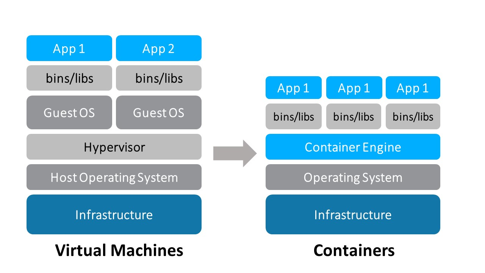

# `container` and `Docker`  basics

[TOC]


## Intuition

### `container`

what is container? check this diagram.




- `container` provides a environment as small as possible to run a software. `container` can be created by `Docker image`, then you can develop on it, after finishing developing, you can commit it back to a `image` and upload it to the [`docker hub`](https://hub.docker.com/). Briefly speaking, it is just a running instance of an `image`.
- `container` filesystem is separated from the host's filesystem
- `container` packages an application with all its dependencies, binaries and libraries allowing it to run independently.

### `Linux namespace`

a `Linux feature` that `container` use to isolate different `container`. 

`Namespace`  enables `Linux processes` to be isolated in their own system environments without interfering with each other.

### `Docker`

A `container` runtime to create `container`.  a `implementation` of `container runtime interface`

### `Docker Daemon`

The **`Docker daemon`** ( `dockerd` ) listens for **`Docker`** API requests and manages **`Docker`** objects such as images, containers, networks, and volumes. A **`daemon`** can also communicate with other **`daemons`** to manage **`Docker`** services.

### `Docker image`

A **`Docker image`** is a read-only template that contains a set of instructions for creating a container that can run on the **`Docker`** platform. It provides a convenient way to package up applications and preconfigured server environments, which you can use for your own private use or share publicly with other **`Docker`** users.

[reference here](https://jfrog.com/knowledge-base/a-beginners-guide-to-understanding-and-building-docker-images/#:~:text=A%20Docker%20image%20is%20a,publicly%20with%20other%20Docker%20users.)

## comparison

### different between VM and container


|            | virtual machine                                              | container                                                    |
| ---------- | ------------------------------------------------------------ | ------------------------------------------------------------ |
| difference | 1.  guest `OS`<br />2.  full stack, run a full copy of `OS` but also a virtual copy of all the hardware, for example, if your VM runs out of the `RAM`, you need to shut it down and reconfigure. | 1. no guest `OS`<br />2.  more dependent on the host `OS`, just run the executive code and necessary `lib` |
| common     | both have `image`                                            | both have `image`                                            |
| benefits   | 1.  All `OS` **resources** available<br />2.  stronger **isolation**<br />3.  better know **security** controls and tools | 1.  reduced IT **management** resources<br />2.  **spin up** quickly<br />3.  less code to **migrate** and **transfer** |


### different between VM image and docker image

1. **Snapshot process is faster in Docker than VMs**

   We generally start with a base image, and then make our changes, and commit those changes using docker, and it creates an image. This image contains only the differences from the base. When we want to run our image, we also need the base, and it layers our image on top of the base using a layered file system. File system merges the different layers together and we get what we want, and we just need to run it. Since docker typically builds on top of ready-made images from a registry, we rarely have to "snapshot" the whole OS ourselves. This ability of Dockers to snapshot the OS into a common image also makes it easy to deploy on other docker hosts.

2. **Startup time is less for Docker than VMs**

   A virtual machine usually takes minutes to start, but containers takes seconds, and sometime even less than a second.

3. **Docker images have more portability**

   Docker images are composed of layers. When we pull or transfer an image, only the layers we haven’t yet in cache are retrieved. That means that if we use multiple images based on the same base Operating System, the base layer is created or retrieved only once. VM images doesn't have this flexibility.

4. **Docker provides versioning of images**

   We can use the docker commit command. We can specify two flags: `-m` and `-a.` The `-m` flag allows us to specify a commit message, much like we would with a commit on a version control system:

   ```bash
   $ sudo docker commit -m "Added json gem" -a "Kate Smith"
   0b2616b0e5a8 ouruser/sinatra:v2
   4f177bd27a9ff0f6dc2a830403925b5360bfe0b93d476f7fc3231110e7f71b1c
   ```

5. **Docker images do not have states**

   In Docker terminology, a read-only Layer is called an image. An image never changes. Since Docker uses a Union File System, the processes think the whole file system is mounted read-write. But all the changes go to the top-most writeable layer, and underneath, the original file in the read-only image is unchanged. Since images don't change, images do not have state.

6. **VMs are hardware-centric and docker containers are application-centric**

   Let's say we have a container image that is 1GB in size. If we wanted to use a Full VM, we would need to have 1GB times the number of VMs you want. In docker container we can share the bulk of the 1GB and if you have 1000 containers we still might only have a little over 1GB of space for the containers OS, assuming they are all running the same OS image.

[reference here](https://stackoverflow.com/questions/29096967/what-are-the-differences-between-a-vm-image-and-a-docker-image)

## operation and command

We operate the `container`, which are created by `Docker image` 

### start - build, pull and run

The diagram of `docker build`, `docker pull` and `docker run`


To create a `container`, you must have a local `image` to use (If not present, one will be pulled to your local system). Most `images` are stored on the public `Docker Hub registry` and are pulled automatically as part of the docker run command. Docker images can also be stored on private or other registries.

The most common and popular `registry` to use is [`Docker Hub`](https://hub.docker.com), a cloud-based repository where `Docker` users and partners create, test, store, and distribute `container images`. 

commands:

- ```bash
  docker run --name [Name_of_your_container] -d -p 80:80 [Image_name]
  ```

  - `-d`: Runs the `container` in detached mode leaving your current terminal free as well as allowing the `container` to run in the background.
  - `-p`: Specifies the ports. The number on the left is the port on the host machine (running `Docker`) and the number on the right is the port that will receive the traffic within the `container`.

- to view all of the `images` stored on teh local system: `docker images`

### check the containers

- `docker ps --format "table {{.Names}}\t{{Image}}"`

### go into `container`

- create a interactive seesion with the container `docker exec -it [name of container] /bin/bash`

### file system

- ```bash
  docker cp train/. [Name_of_your_containter]:/usr/share/nginx/html
  ```

  - `.`: copy the contents of the directory and not the directory itself

### network

Since `container` works on the host, we need to map the `host port` to `container port`.  When we run 

- ```bash
  docker run --name [Name_of_your_container] -d -p 80:80 nginx
  ```

actually we map the host's 80 port to our `container`'s 80 port, since the `nginx` listen to the 80 port (of our `container`), so it is unconvenient to change the `container`s port. We can change the host's port from 80 to 8080 by using the command below.

- ```bash
  docker run --name [Name_of_your_container] -d -p 8080:80 nginx
  ```

### commit and push

In this part we need to commit `container` to `image` to try to push `image` to the `Docker Hub`. don't confuse `container` and `image` here.

####  create account

 [`Docker Hub`](https://hub.docker.com/)

#### commit

After developing the software in the `container` you can package it up back to `Docker image` (commit) by the code below.

```bash
docker commit -m="any message you want" [container_name] [image_name]
```

view the `images` to check the new `image` has been generated: `docker images`

#### login

`docker login`

#### tag

When developing with `containers` it is important to tag your `images`. The convention you use to assign a tag is up to you; however if no tag is specified, the "latest" tag will be assigned by default. The same applies when requesting `images` - if no tag is specified, the latest tag will always be assumed. This means that if you create an `image` with the tag "blueVersion", you must specify that tag when you try and retrieve it. Otherwise, `Docker` will look for the "latest" tag.

```bash
docker tag [IMAGE_ID] [DockerHubUsername]/[DockerHubRepo]:[tag]
```

To get the `IMAGE_ID`, use `docker images` to find the `image` you just commit.

Then there are now two different "versions" (defined by tags) on your machine:

- One with the "latest" tag that was used by default when you created the image.
- One with the tag you just created.

#### push

```bash
docker push [DockerHubName]/[DockerHubRepo]:[tag]
```

### docker remove

`docker stop [container_name]` first and then `docker rm [container_name]`.