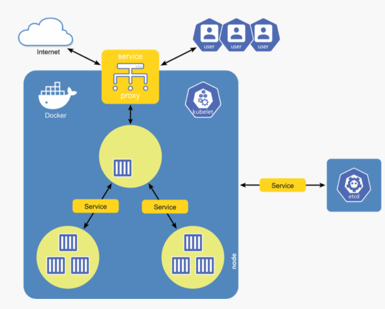
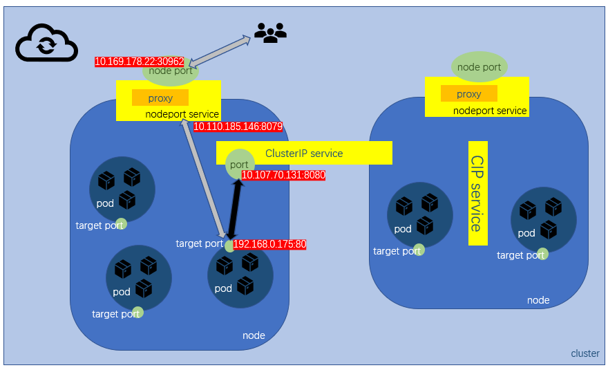
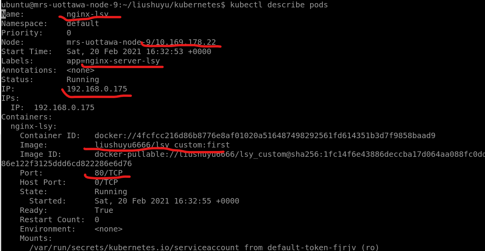
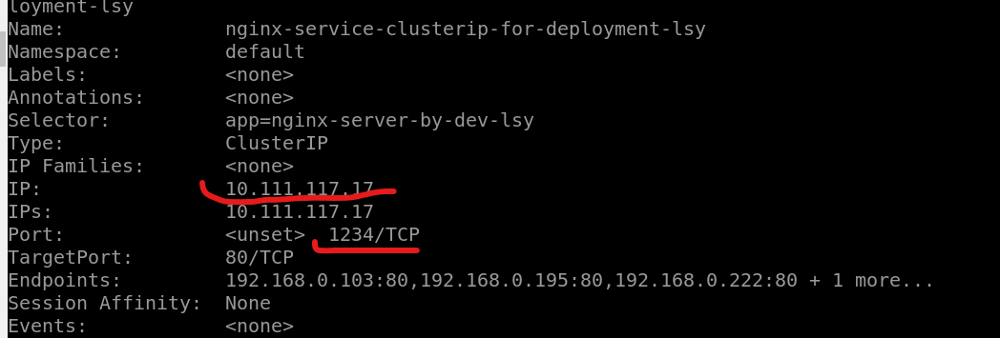
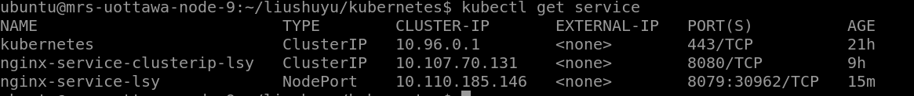
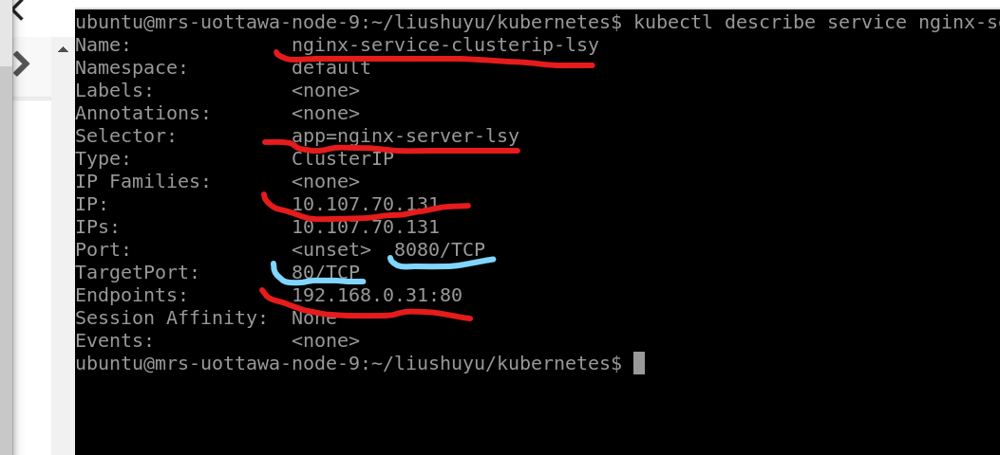
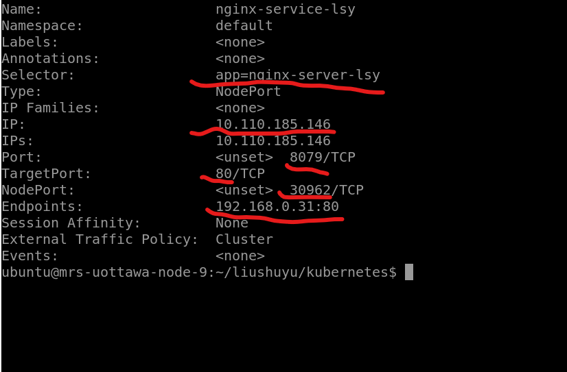

[TOC]


# Theoretical Knowledge

## `Kubernetes`

an open-source `container` orchestration tool for automating deployment, scaling and management of containerized applications"

The hierarchy is `containers -> pods -> nodes -> cluster -> objects`

## `pods`

In `Kubernetes`, `Pods` are responsible for running your `containers`. Every `Pod` holds at least one `container`, and controls the execution of that `container`. When the `containers` exit, the `Pod` dies too. All `containers` within a `pod` share same resources (IP, storage, RAM).

A `pod` is the smallest entity in the `Kubernetes universe`.

## `node`

A collection of pods.

- A physical or virtual machine that serves a specialized function either as a `master node` or a `worker node`.

### `work node`

Each worker `node` can hold one or more pods. 

#### components

- `kubelet process` : connect to other nodes
  - runs on all worker nodes
  - connect the control plane (via the `API Server`) with containers (via `container runtime interface CRI`): takes instructions from the **control plane** to manage the **state of the node**: starting, stopping, and maintaining application containers. 
  - Collects **performance and health information** of the pods and their running containers, and then **shares** that information with the control plane to help it make scheduling decisions.
  - Connects to the **container runtime** using the Container Runtime Interface (CRI).
- `Container Runtime Engine`: run`container`
  -  to run and manage a container's life cycle.
  -  Kubernetes supports various container runtimes such as Docker, CRI-O, containerd, etc.
  -  Docker engine is the most common container runtime and is almost ubiquitous now.
- `kube-proxy` connect to the external world and load balancing between the pods
  - on **every node**
  - is responsible for **routing traffic** to the appropriate pod based on the **incoming IP address**
  - that exposes the node to the **external world** 
  - Prevents **IP conflicts** on the pods
  - Responsible for **port mappings**
  - is responsible for connectivity and **load balancing** between the pods.

### `master node`

- **managing** other `worker nodes` and **balance** the workloads. 
- It provides the control plane; Kubernetes cluster services
- It handles the **scheduling** of work in the cluster, including:
  - Deploying and starting up objects on worker nodes in order to meet the configured requirements (desired state)

Admins can access the Kubernetes master node to manage the Kubernetes cluster using:

1. `kubectl` (command-line interface)
2. Dashboard UI (web-based user interface)

#### components of control plane

These components together form the **Kubernetes Control Plane.**

- `API Server` interface
  - Key management component of the entire cluster
  - The main access point to the cluster
  - Provides both internal and external interfaces
  - Updates the `etcd` with the changes in the cluster and it invokes the Scheduler and `kubelet` process when a new pod is created
  - Responsible for the authentication and authorization allowing administrators to interact with the API Server
- `etcd`: store state and configuration data
  - Persistent and distributed key-value store that contains the state and configuration data for the entire cluster.
  - It can be configured on the master node or configured externally.
  - Each node has access to etcd, and through it, learns how to maintain configuration of its running containers. We can run etcd as a:
    1. **Distributed Database:** In a multi-node cluster with multiple master nodes; implements logs to make sure no conflicts between masters
    2. **Standalone Database:** In a single-master node cluster
- `scheduler`: resources
  - Assigns newly created and unscheduled pods to nodes
  - Some pods may require a specific set of resources to run, and it is the scheduler's responsibility to find a node that meets those requirements.
  - For this purpose, the scheduler must know the resource requirements, resource availability of the nodes, and other user-provided constraints in order to maximize the proper resource utilization.
- `controller manager`: state
  - Supervises different controllers that drive actual cluster state toward the desired cluster state.
  - Communicates with the API server to create, update, and delete the resources it manages (pods, service endpoints, etc.).
  - Watches the state of the cluster through the API server and makes the necessary changes to move the cluster from current state* present in the etcd to the desired state defined in the configuration file*. This usually involves operations like application scaling up/down or adjusting endpoints, etc.

[details](https://kubernetes.io/docs/concepts/overview/components/#control-plane-components)

## `cluster`

The `cluster` is a collection of `nodes` managed by one or more `master nodes`.

## `Replication Controller`

to manage a set of `pods`, the number of `pods` will be maintained.

## `ReplicaSets`

next generation of `Replication Controller`.

A `ReplicaSet` ensures that a set of identically configured `Pods` are running at the desired replica count. If a `Pod` drops off, the `ReplicaSet` brings a new one online as a replacement.

## `deployment`

A `Kubernetes` object that controls deploying and maintaining a set of `pods`. Uses a `ReplicaSet` to keep the `pods` running. Supports rolling updates and rollbacks, rollouts can be paused. So everytime when you create `deployment` you can see the `ReplicaSet (RS)`.

It generates a specified number of `pods` as you configure in `yaml` file automatically with the same `label`. Remember, `deployment` itself don't have `IP`, so if you want to connect to the `pods` generated by a certain `deployment`, don't attempt to connect to the `depolyment` but try to use the `label`.

##  `service`

A service inside a Kubernetes node acts as a virtual bridge allowing a set of pods to “talk” to another set. It enables communication within the `Kubernetes` cluster and outside.



## `secret`

`Secrets` are used to store non-public information, such as tokens, certificates, or passwords. Secrets can be attached to `Pods` at runtime so that sensitive configuration data can be stored securely in the cluster.

## `DaemonSets`

`DaemonSets` provide a way to ensure that a copy of a `Pod` is running on every node in the cluster. As a `cluster` grows and shrinks, the `DaemonSet` spreads these specially labeled `Pods` across all of the nodes.

## `Ingresses`

`Ingresses` provide a way to declare that traffic ought to be channeled from the outside of the cluster into destination points within the cluster. One single external `Ingress` point can accept traffic destined to many different internal services.

## `CronJobs`

`CronJobs` provide a method for scheduling the execution of `Pods`. They are excellent for running periodic tasks like backups, reports, and automated tests.

## `CRD`

`CustomResourceDefinitions`, or `CRDs`, provide an extension mechanism that cluster operators and developers can use to create their own resource types.

## `manifest file`

a `yml` file, work with `kubectl`, is composed of five fields:

- `apiVersion` version
- `kind`: `kind` of object you want to create
- `metadata`
- `spec`
- `status`

## network



- use `selector` and `labels` to specify the connectivity between `pod` and `service` not the `name` but the `labels`
- three `ports`
  - `node port`: Same for all nodes in a cluster
  - `port`
  - `target port`
- `services`
  - `nodeport service` : 
    - It forwards the request to a `ClusterIP service`, the latter will forward the request to the port on the `pod` running the application.
    - NodePort services are reachable by clients on the same LAN or clients who can ping the Kubernetes host nodes.
    - But they cannot be reached from anywhere on the Internet.
  - `ClusterIP service`: 
    - communication bewteen `pod` and `pod` across node in a `Kubernetes cluster`. 
    - can't access to the external access.

# Practice and Lab

In the Lab, we will get three section:

- `pod -> Replication Controller`
- `pod -> Deployment`
- `pod -> Service (CIP, NodePort)`

They use the `label` to specify the connectivity.

In the Lab, node is the remote VM.

## install

```bash
sudo apt-get update && sudo apt-get install -y apt-transport-https curl
curl -s https://packages.cloud.google.com/apt/doc/apt-key.gpg | sudo apt-key add -

cat << EOF | sudo tee /etc/apt/sources.list.d/kubernetes.list
deb https://apt.kubernetes.io/ kubernetes-xenial main
EOF

sudo apt-get update
sudo apt-get install -y kubelet kubeadm kubectl
sudo apt-mark hold kubelet kubeadm kubectl
```


## initial

- ```bash
  sudo kubeadm init --pod-network-cidr=192.168.0.0/16 --dry-run
  ```

  - `--dry-run`: don't apply any changes; just output what would be done. [reference](https://kubernetes.io/docs/reference/setup-tools/kubeadm/kubeadm-init/#options), it will tell you the errors when they occur.
  - `--pod-network-cidr [string]`: Specify range of IP addresses for the `pod` network. If set, the control plane will automatically allocate [`CIDR`](https://www.keycdn.com/support/what-is-cidr) for every node. [reference](https://kubernetes.io/docs/reference/setup-tools/kubeadm/kubeadm-init/#options)
  - after this command, we use `docker ps` will not see a lot of `Docker containers`.

- If you have some errors:

  - **Issue**: `[ERROR FileContent--proc-sys-net-bridge-bridge-nf-call-iptables]: /proc/sys/net/bridge/bridge-nf-call-iptables does not exist`
    **Solution**: `sudo modprobe br_netfilter`

  - **Issue**: `[ERROR Swap]: running with swap on is not supported. Please disable swap`
    **Solution**: `sudo swapoff -a`

  - **Issue**: `[ERROR FileContent--proc-sys-net-ipv4-ip_forward]: /proc/sys/net/ipv4/ip_forward contents are not set to 1`

    **Solution**: `sudo bash -c 'echo 1 > /proc/sys/net/ipv4/ip_forward'`

- if you already initialize a `Kubernetes`, `sudo kubeadm reset  `

- really initialize it!  `sudo kubeadm init --pod-network-cidr=192.168.0.0/16`

  - there will be 8 more items while using `docker ps | grep kube`
  
- The output also mentions using the `kubeadm` join command to add nodes to your cluster. Since you will only be using one server, you can ignore this command. However, if your master node and worker nodes were on different servers, you would need to copy this join command and run it on the workers in order to add them to the cluster.


## configuration

The commands below will set up the proper location so that the cluster can use the config file generated during the `init`. This includes the certificates the cluster will use.

- ```bash
  mkdir -p $HOME/.kube
  sudo cp -i /etc/kubernetes/admin.conf $HOME/.kube/config
  sudo chown $(id -u):$(id -g) $HOME/.kube/config
  ```
  
  - **mkdir** -**p** means: create the directory and, if required, all parent directories.

## network add-on

Why we need to add-on network

`Kubernetes` does not come with networking built-in. Before a functional cluster can be deployed, you must first install a `pod` network add-on so that the `pods` can communicate with each other. There are many different networking add-ons that all leverage the `Container Network Interface (CNI)` but for testing purposes it doesn't really matter which one is chosen.

- ```bash
  kubectl create -f https://raw.githubusercontent.com/cilium/cilium/1.7.3/install/kubernetes/quick-install.yaml
  ```

  - if get some authority error, setup configuration file again. [check here](https://stackoverflow.com/questions/63344900/kubernetes-unable-to-connect-to-the-server-x509-certificate-signed-by-unknown)

## enable the schedule of master node

Normally, the `Kubernetes master` is responsible for scheduling work onto `worker nodes`. By default, `Kubernetes` does not allow the `master node` to schedule work onto itself by using a `taint`. A `taint` is similar to a label that tells the `master node` that it is unavailable to have work scheduled on it.

- check `node`'s name by `kubectl get nodes`

- check the `taint` by 

  ```bash
  kubectl describe nodes [name of your node] | grep -i Taints
  ```

  

- disable it: `kubectl taint nodes --all node-role.kubernetes.io/master-`

##  `pods`

- create `pod.yaml`

  ```yaml
  apiVersion: v1
  kind:  Pod
  metadata:
    name: nginx-lsy
    labels:
      app: nginx-server-lsy
  spec:
    containers:
      - name: nginx-lsy
        image: [yourDockerHubUsername]/[yourNginxImage]:[yourTag]
        ports:
          - containerPort: 80
  ```

  - pay attention the name use dash "-" not underscore.
  - when the pod generate, the below chart describe the node we generate.
  - pay attention to the `labels` field, which is very important when connect to the `CIP service` or `NodePort`.

- create `Pod` by `kubectl create -f pod.yaml`

- check `pod` by `kubectl get pods` or `kubectl describe pods`

  

  - pay attention to the `labels` field, which is very important when connect to the `CIP service` or `NodePort`.
  - We know the `pod` IP is 192.168.0.175 and port is 80
  - The IP of the `node` that contains this `pod` is 10.169.178.22, sometimes you can get the `node` IP from `ifconfig`, but it is not always right when you have multiple `nodes` running on your machine.

- `curl` into `pod` by `curl [IP Address]`

- enter the `container` by `kubectl exec -it [name of pod] -- /bin/bash`

- delete pod by `kubectl delete pods [pods name]` or `kubectl delete -f pod.yaml`

## `Replication controller`

- create `rc.yaml`

  ```bash
  apiVersion: v1
  kind:  ReplicationController
  metadata:
    name: nginx-rc-lsy
  spec:
    replicas: 3
    selector:
      app: nginx-server-lsy
    template:
      metadata:
        name: nginx-replicationController-lsy
        labels:
          app: nginx-server
      spec:
        containers:
        - name: nginx-lsy
          image: [yourDockerHubUsername]/[yourNginxImage]:[yourTag]
          ports:
            - containerPort: 80
  ```

  - use `selector -> app` to link to the `pods`

- create the `Replication Controller` by `kubectl create -f rc.yaml` and check it by `kubectl get rc`

- scale `rc` by `kubectl scale rc nginx-rc --replicas=10`

- delete `rc` by `kubectl delete rc [name of rc]` or `kubectl delete -f rc.yaml `

- pay attention, if you don't delete `rc` first, you will never delete all `pods` maintained by `rc`.

## `Deployment` and `Replica Set`

`Replica Set` , which can be managed by the `Deployment`. is the next generation of `Replication Controller`. `Deployment` creates and uses the `RS` to sclae up and down the `set of pods`, besides, `Deployment` can be rolling updates and rollbacks, etc.

- create a `deployment.yaml`

  ```bash
  apiVersion: apps/v1
  kind:  Deployment
  metadata:
    name: nginx-deployment
    labels:
      app: nginx-server-dev-lsy # label 1
  spec:
    selector:
      matchLabels: # matchLabels selector: need to match label 2
        app: nginx-server-by-dev-lsy
    replicas: 4
    template:
      metadata:
        labels:
          app: nginx-server-by-dev-lsy # label 2: need to match matchLabels selector
      spec:
        containers:
        - name: nginx-custom-lsy
          image: [yourDockerHubUsername]/[yourNginxImage]:[yourTag]
          ports:
          - containerPort: 80
  ```

  - label 1: don't know

  - label 2: the `pods` it created will be assigned to this label

  - `matchLabels selector`: when `pods` are created, the `Deployment` can find them by this `selector`.

  - if you want the service to connect to this, make the `selector` be the same as the label 2.

  - when you create `deployment`, the `RS` will also be created.

  - Here is how to connect to the `clusterIP service`

    - configure `clusterip_for_deployment.yaml`

      ```bash
      apiVersion:  v1
      kind: Service
      metadata:
            name: nginx-service-clusterip-for-deployment-lsy
      spec:
        type: ClusterIP
        ports:
          - port: 1234
            protocol: TCP
            targetPort: 80s
        selector: 
          app: nginx-server-by-dev-lsy # pay attention here, should be the same as label 2
      ```

    - create and check, make sure the `endpoint` is right

      

      the `IP` of the `service` is 10.111.117.17 and `port` is 1234, which means `1234 <-> 80 of the pod`. use `curl 10.111.117.17:1234` could access to the nginx.

    

- create via `kubectl create -f [fileName]`

- check by `kubectl get deployments` or `kubectl get rs`.

- scale by ` kubectl scale deployments [DeploymentsName] --replicas=8`

- delete by `kubectl delete deployment [Name]` or `kubectl delete -f [fileName]`

## `service`

service can be checked through `kubectl get service`



Pay attention to the `Cluster-IP`, they should be the same as the ip address you use describe in each `service`.

## `ClusterIP service` CIP

`Kubernetes` has a default ClusterIP service called "kubernetes" that can be viewed. So, anytime using `kubectl get svc` you can find it.

- create `clusterip.yaml`

  ```bash
  apiVersion:  v1
  kind: Service
  metadata:
        name: nginx-service-cluster-lsy
  
  spec:
    type: ClusterIP
    ports:
      - port: 8080
        protocol: TCP
        targetPort: 80
    selector: 
      app: nginx-server-lsy
  ```

  - pay attention, the `spec -> selector -> app`'s name in `clusterip.yaml` must be the same as the pod's `metadata -> labels -> app`'s label in `pod.yaml`, or the `CIP service` can't find the `pod`.
  - In the `ports` field, it maps `port` with `targetPort`, since `selector` specifies the `label` of the app, all `pods` connect to this `CIP service` will use the same `targetPort`.

- create the `CIP service` by `kubectl create -f clusterip.yaml`.

- check `service` by `kubectl get service` or `kubectl describe svc [service name]` or `kubectl describe service`

  

  - `Endpoints` means `<PodIP>:<TargetPort>`, remember both `PodIP` and `TargetPort` are relative to `Pod`. If you check `Pod`'s description, you will find the `Ip` field is the same as the `<PodIP>` in the `Endpoints`.
  - `Ip` field means `CIP service Ip`  and equalls to `ClusterIP`.
  - `Port` fields means `Port`.
  - The `CIP service`'s IP is 10.107.70.131 the `port` is 8080, since the `selector` is the `pod` above, so that is `10.107.70.131:8080 <-> 192.168.0.31:80`

- don't forget to create `pods`, since `CIP service` is just a bridge. if not, the `Endpoints` field in the description of `CIP service` will be `none`.

- access to the `pod`

  - access direct to the `pod` by using `<PodIP>:<TargetPort>`
  - access from the `CIP service` by using `<IP>:<Port>`

## `NodePort service`

- This `NP service` is relative to two IP and two port. The first IP is about the `clusterip service` that `NP service` create automatically. The second is about the node's ip.
  - `ClusterIP service`: use `kubectl get services` to see the automatically created `ClusterIP service`'s ip.
  - `node`: the node's ip (usually the `VM`) use `kubectl describe pods`

- create `.yaml` file

  ```bash
  apiVersion: v1
  kind:  Service
  metadata:
    name: nginx-service-lsy
  spec:
    type: "NodePort"
    ports:
      - port: 8079
        protocol: TCP
        targetPort: 80
    selector:
      app: nginx-server-lsy
  ```

  - the `selector -> app` should be the same as the `labels` of the `pod` that you want to connect.
  - we specify the `port` as 8079, which indicates that `8079 <-> 80 of the pod`

- create the `NodePort` via `kubectl create -f [fileName] `

- check it

  

  - `selector` 
  - `clusterip service`'s id is 10.110.185.146 and here are two `ports`: 8079(`clusterip service`)/30962(`node`), the `targetPort (PodPort)` is 80.

## connectivity and access to `pod`

Here are actually four ways to access to the `nginx pod`. List the ip and port we need:

|            |                 pod                 |          CIP service          |                       NodePort service                       |
| ---------- | :---------------------------------: | :---------------------------: | :----------------------------------------------------------: |
| IP         |            192.168.0.175            |         10.107.70.131         | `clusterip service ` which is created by the `NodePort Service` automatically:10.110.185.146 <br />`nodePort`: 10.169.178.22 (node IP, since node is usually the `VM`) |
| port       | 80(since `Nginx` listen to 80 port) |             8080              |             `CIP service`:8079<br />`node`:30962             |
| map        |                                     | `pod:80 <-> CIP service:8080` | `inner`:`pod:80<->CIP:8079`<br />`outer`:`pod:80<->nodeIp:30960` |
| how to get |         `describe` command          |      `get` or `describe`      | `CIP`: `get` or `describe`<br />node: `kubectl get pods` you will see a Node item. |

Here the `NP service` has two part, the `CIP` means the IP of `CIP` which was created by `NP service` automatically, the `outer` means the IP of the node (usually the `VM`) and outward port.

access to the `Nginx Pod`

- access to the pod directly through `curl [Pod_IP]:[TargetPort]` that is `curl 192.168.0.175:80`.
- (if `CIP service` is running) access through `CIP service` through `curl [CIP_IP]:[Port]` that is `curl 10.107.70.131:8080`.
- (if `NP service` is running) access through `CIP service` created by `NP service` through `curl [CIP]:[CIPport]` this is `curl 10.110.185.146:8079`
- **external access**: (if `NP service` is running) access through `NP service` externally.  First use `kubectl describe pods` to find it under the Node entry, then `curl [node_ip]:[outer_port]`, that is `curl 10.169.178.22:30962`.

## label and unlabel

- show label 

  ```bash
  kubectl get <object_kind> --show-labels
  ```

- label or unlabel

  ```bash
  kubectl label <object_kind> <object_name> key=value
  
  kubectl label <object_kind> <object_name> <key>-
  ```

  

## reference

- check [options](https://kubernetes.io/docs/reference/setup-tools/kubeadm/kubeadm-init/#options)