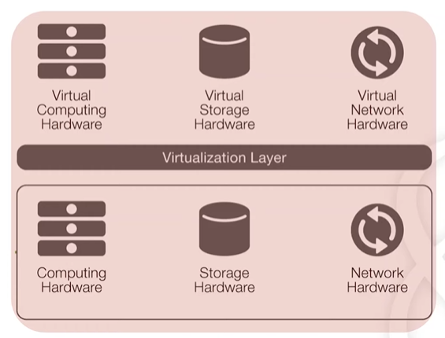
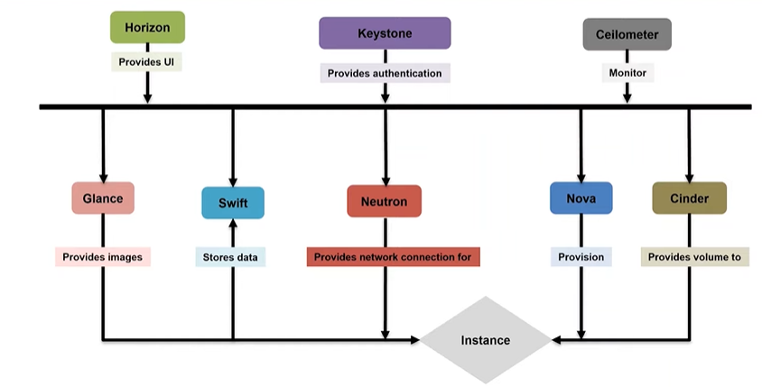
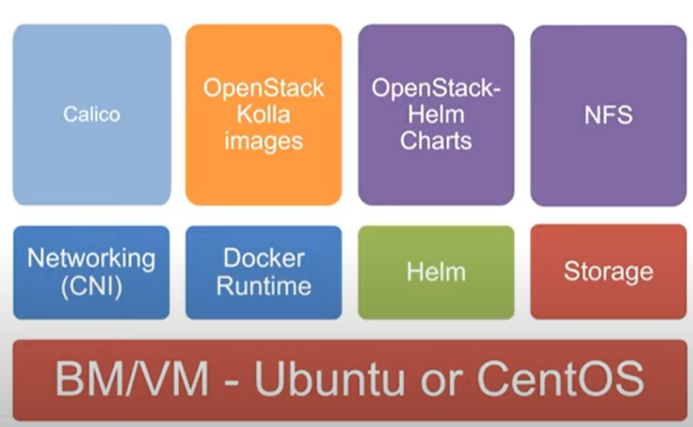
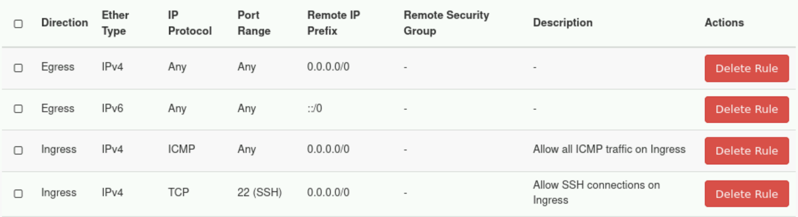

# NFVI

## start

- **NF**: routing and load-balancing
- **NFV**: such as Virtual Box, VMWare
- **VNF**:
- **NFVI**: NFVI servers
  - Virtual computing hardware: Nova
  - Virtual storage hardware: Cinder
  - Virtual network hardware: Neutron 
- **MAMO**
- virtualization layer: Open Stack act as virtualization layer, try to



## build the NFVI

1. There are servers with network interfaces
2. They can be part of a number of networks, network plane always composed of management plane, control plane and data plane.
   - IPMI: management plane, carry out the administrative traffic, control the servers power, access the console...
   - admin: control plane.
   - data: carry your actual data, data plane.
   - public

## underlay and overlay network

**underlay**:

- Layer 2/3+ physical network or network infrastructure
- carry data between endpoints connected to it.

**overlay**:

- build on top of "underlay"
- overlapping IP address space
- VLAN, VxLAN: to isolate the instances
- Linux routing...

## [details](https://www.youtube.com/watch?v=d4uTnGGFTf8&t=1511s)


# OpenStack Theory

## start

OpenStack is a cloud operating system. an IaaS server.


## components

### conceptual architecture



### `Nova`

- manages provisioning your virtual machine in cloud.
- can be accessed through 
  - `Horizon` : user interface
  - `OpentStack` Client: command line interface, for all other components.
  - `Nova` Client Python API: specific nova request, towards the nova component.
- Nova requires `Keystone` (for authentication), `Glance` (for images) and `Neutron` (for networking) in order to work!
- `Nova` go to `Glance`, pick up the image and spin up the image

### `Cinder`

- provides persistent block storage for instance. also called volume storage.
- hard drive, provide access to the persistent storage of your instance.
- manage the life cycle of volume storage.

### `Neutron` 

- refers to as a tenant
- DNS: access to the external world
- DHCP: dynamic host configuration protocol, automatically give an IP address from a pool.
- networking
- IP address management: assign IP address
- security groups: equivalent to the network policies, controls the traffic to flow in or flow out.

### `Glance`

- image service
- when start a compute instance, actually the image will be copied from Glance to the instance for it to use.

### `Swift`

- object storage to store static data such as images, videos or images of virtual machine and backup files.

- store and retrieve arbitrary data in the cloud.

- provides a simple API for storing and retrieving data.
  - native API
  - AWS S3-compatible API
  
  

### `Keystone`

- identity service, authentication and authorization

### `Horizon`

- UI, or dashboard

### `Heat`

- provides orchestration services
- used to deploy multiple complex cloud resources described in text files called templates (written in .yml). 
- The Heat Service implements an orchestration engine to parse and execute these templates.
- templates:
  - Intrinsic function: such as getting a value of the resource attribute, or referring to another resource within the same template.
  - Resource is used to declare instances, networks, ports, routers, firewall rules, etc.
  - Parameters is used to specify optional output.

### `Ceilometer`

- monitor the usage of your tendencies

### components

- [main] virtual computing hardware: `NOVA`
- [main] virtual storage hardware: `Cinder`
- [main] virtual network hardware: `Neutron`
- `Horizon`

### something about commerce


# `OpenStack-Helm`

## start

- package manager for Kubernetes
- deploy, install and upgrade complex **Kubernetes applications** in an automatic way. 
- In `Helm` containerize all the components of OpenStack into containers in your cluster. 
- Charts tell Helm what is being deployed and how it should deploy it to the cluster.
- platform that use to deploy Open Stack on the top of Kubernetes cluster. 
- Hierarchy: Hardware -> Kubernetes -> Helm -> Open Stack -> Components

## component



# Lab Practice

## Dashboard

### permission

|                | admin             | member            |
| -------------- | ----------------- | ----------------- |
| project        | create and manage | no                |
| user and roles | create and manage | no                |
| security group | configure         | configure         |
| instance       | launch and manage | launch and manage |
| network        | create and manage | create and manage |
| routers        | create            | create            |
| OS images      | upload and manage | no                |
| flavor         | create            | no                |

### create a network

you need to have the following network information:

- Network Name
- Admin State

#### create a subnet and assign it

and then you need to configure a subnet

- subnet address
- gateway IP
- DHCP enable or disable
- DNS Name Server
- static route IP address (If Applicable)

after create it, you need to assign it, if users want to have external traffic to flow to any internal network within the cloud tenancy, it is required to add an interface on the internal network as well.

### create a router

- routes traffic within OpenStack tenancy **between instances**
- routes traffic to/from outside elements such as the **internet** to the cloud

### create a security group

virtual firewall for servers.

- source/destination
- port
- protocol

### launch an instance

- instance name
- flavor
- count: how many instances you want to deploy
- image for the VM
- key-pair(public key)
- networks connections

## create and configure Ubuntu Instance in OpenStack

### create a security group

- OpenStack has a default built-in security group that only allows outbound traffic from your instances.

- In order to connect to your instance, you need to allow SSH connections on ingress.

- In order to ping your instance, you need allow all ICMP traffic on ingress.

- enable ingress of all ICMP and TCP

  

### create an internal network

#### create an associated subnet

- OpenStack has a default external network
- enable Admin State
- select a **Class C** network address, such as `192.168.2.0/24`, network should be 0 at the last bit.
- add a gateway IP, it is better to select `192.168.2.1`, when creating the router interface, this will be its IP address
- configure allocation pools, from `192.168.2.2` to `192.168.2.254`, exclude `192.168.2.1` since it has been allocated to the gateway.
- configure DHCP and DNS.

#### create a router

- add an interface to the router attaching it your newly created private network.

### create an image

- download an Ubuntu image

  ```shell
  wget https://cloud-images.ubuntu.com/bionic/current/bionic-server-cloudimg-amd64.img
  ```

  - `wget`: download from internet

- source `openrc`

  ```shell
  source openrc
  ```

  - `source`: built-in command, read and execute the content of a file.
  - `openrc`: client environment scripts.
  - You only need to run this once per terminal session. The exported variables persist for the duration of the session.

- create image

  ```shell
  openstack image create "ubuntu_18.04_yourName" --file bionic-server-cloudimg-amd64.img --disk-format qcow2 --container-format bare --public
  ```

  

### create an SSH Key Pair

- You will need to create an SSH key pair so that you can access the terminal on your instance. This is because the Ubuntu image does not have a password login configured by default.

1. ```shell
   ssh-keygen -t rsa -b 4096
   ```

2. ```shell
   cat ~/.ssh/id_rsa.pub
   ```

3. import it to the Horizon

4. change the permission

   ```shell
   chmod 400 <id_rsa location>
   ```

### Flavor

a "flavor" specifies the compute, memory, and storage resources for an instance. Typically, admins create flavors of varying sizes so they match various applications needs.

### launch an Instance

- assemble your instance with your configured security group, network, router, image and SSH keypair.

### Assign a floating IP

- private IPs are assigned to the instance by default to connect between instances. These are most likely to be used for communication **between instances** within a private network. Private IPs **do not allow us to access the instances from the external** network.
- public IP
  - public IP is used to communicate with the outer world, so that you can ping it from the platform where the OpenStack deployed in. 
  - Only one Floating IP can be attached to an instance at any given time. 
  - can be fetch and detach by user.
  - The OpenStack administrator configures a subnet of publicly accessible IP addresses called a **Floating IP Pool**.
  - bind IP address from your internal network with the floating IP.
  - ping to confirm the connectivity, Make sure your Security Groups are properly set or this will not work.
- what you need to do in HEAT template (`yaml` file)
  - create a floating IP, allocate an external network(public)
  - assign an IP address from your internal network to the port
  - associate the floating IP with the port

### connect to the instance from the platform

- ```shell
  ssh ubuntu@<Instance Floating IP> -i ~/.ssh/id_rsa
  ```

- to check the internet connectivity, try `ping 8.8.8.8`;

### firewall

- the access to the instance is not only block by the security group but also block by the `ufw` (uncomplicated firewall) in the instance, so don't forget to configure two "walls".

- enable `ufw`

  ```shell
  sudo ufw enable
  ```

- allow Nginx HTTP and SSH

  ```shell
  sudo ufw allow 'Nginx HTTP'
  
  sudo ufw allow 'OpenSSH'
  
  sudo ufw status	
  ```

- create a new rule to allow the HTTP connection in security group!

## configure by `.yaml` `Heat`

### yaml

**YAML** (a [recursive acronym](https://en.wikipedia.org/wiki/Recursive_acronym) for "YAML Ain't Markup Language") is a [human-readable](https://en.wikipedia.org/wiki/Human-readable) [data-serialization language](https://en.wikipedia.org/wiki/Serialization). It is commonly used for [configuration files](https://en.wikipedia.org/wiki/Configuration_file) and in applications where data is being stored or transmitted.

### The components of the `.yaml`

- `heat_template_version`: mandatory
- `description`: optional
- `parameter_groups`: optional
- `parameters`: optional, specify optional inputs that customize the deployment
- `resources`: mandatory, declare **instances**, **networks**, **ports**, **routers**, **firewall rules**.
- `outputs`: optional
- `intrinsic function`: refer to another resource within the template

### intrinsic function

refers to other resouces

- `get_attr`: get attribute of a resource.
- `get_param`: get parameters from the `parameters` section.
- `get_resource`: refer to a resource defined within the same template.

### service with resources

- security group: `OS::Neutron::SecutiryGroup`
- port: `OS::Neutron::Port`
- instance: `OS::Nova::Server`
- floating IP: `OS::Neutron::FloatingIP`
- association: `OS::Neutron::FloatingIPAssociation`

### create an instance

`Nova` must work with `Glance`, `Keystone`, `Neutron`.

```yaml
heat_template_version: 2017-02-24
description: Simple template to deploy a single compute instance
resources:
    my_instance:
        type: OS::Nova::Server
        properties:
            image: ubuntu_LSY # Glance
            flavor: default
            key_name: LSY-SSH # Keystone
            networks: # Neutron
                - network: LSY-network
```

### output

```yaml
description: Simple template to deploy a single compute instance
heat_template_version: '2017-02-24'

resources:
  my_instance:
    properties:
      flavor: default
      image: ubuntu_LSY
      key_name: LSY-SSH
      networks: 
      - network: LSY-network
    type: OS::Nova::Server
outputs:
  instance_ip:
    description: ip address of the deployed compute instance
    value:
      get_attr:
        - my_instance
        - first_address
```

### add parameters

```yaml
description: Simple template to deploy a single compute instance
heat_template_version: '2017-02-24'

parameters:
  flavor: 
    description: the flavor
    default: default
    type: string
  image:
    description: the image
    default: ubuntu_LSY
    type: string
  key_name:
    description: the ssh
    default: LSY-SSH
    type: string

resources:
  my_instance:
    properties:
      flavor:
        get_param: flavor
      image:
        get_param: image
      key_name:
        get_param: key_name
      networks: 
      - network: LSY-network
    type: OS::Nova::Server

outputs:
  instance_ip:
    description: ip address of the deployed compute instance
    value:
      get_attr:
        - my_instance
        - first_address
```

### advanced

```yaml
heat_template_version: 2017-02-24
description: Simple template to deploy a single compute instance
parameters:
  net:
    description: the network named LSY-network 192.168.2.0/24
    type: string
    default: LSY-network

resources:
  web_secgroup:
    type: OS::Neutron::SecurityGroup
    properties:
      rules:
        - protocol: tcp
          remote_ip_prefix: 0.0.0.0/0
          port_range_min: 22
          port_range_max: 22
        - protocol: ICMP
          remote_ip_prefix: 0.0.0.0/0

  instance_port_1:
    type: OS::Neutron::Port
    properties:
      network:
        get_param: net
      security_groups:
        - default
        - get_resource: web_secgroup
  instance_port_2:
    type: OS::Neutron::Port
    properties:
      network:
        get_param: net
      security_groups:
        - default
        - get_resource: web_secgroup
          
  instance_1:
    type: OS::Nova::Server
    properties:
      image: ubuntu_LSY
      flavor: default
      key_name: LSY-SSH
      networks:
        - port:
            get_resource: instance_port_1
  instance_2:
    type: OS::Nova::Server
    properties:
      image: ubuntu_LSY
      flavor: default
      key_name: LSY-SSH
      networks:
        - port:
            get_resource: instance_port_2

  floating_ip_1:
    type: OS::Neutron::FloatingIP
    properties:
      floating_network: public
  floating_ip_2:
    type: OS::Neutron::FloatingIP
    properties:
      floating_network: public

  association_1:
    type: OS::Neutron::FloatingIPAssociation
    properties:
      floatingip_id:
        get_resource: floating_ip_1
      port_id:
        get_resource: instance_port_1
  association_2:
    type: OS::Neutron::FloatingIPAssociation
    properties:
      floatingip_id:
        get_resource: floating_ip_2
      port_id:
        get_resource: instance_port_2

outputs:
  instance_ip:
    description: ip address of the deployed compute instance
    value:
      get_attr:
        - instance_1
        - first_address
```


# Questions

- if I want to create an instance, the type that I need to specify
  - OS::Nova::Server
- four properties that need to be specified in the instance
  - image
  - flavor
  - key_name
  - networks
- `get_param`, `get_attr`, `get_resource`
  - `get_param`: This value is resolved at runtime based on the inputs.
  - `get_attr`: attribute of the resource. This value is resolved at runtime using the resource instance created from the respective resource definition.
  - `get_resouces`: refers to a resource defined within the same template. resolved at runtime to the reference ID of the requested resource. 
- **YAML** (a [recursive acronym](https://en.wikipedia.org/wiki/Recursive_acronym) for "YAML Ain't Markup Language") is a [human-readable](https://en.wikipedia.org/wiki/Human-readable) [data-serialization language](https://en.wikipedia.org/wiki/Serialization). It is commonly used for [configuration files](https://en.wikipedia.org/wiki/Configuration_file) and in applications where data is being stored or transmitted.