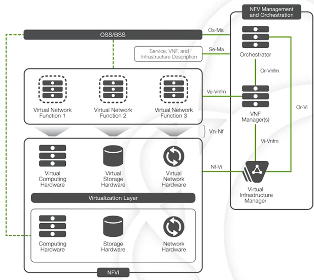

# cloud computing

## Benefits of Cloud Computing

- money: reduced capital, pas as you go payment model.
- resources: elastic resources.
- location: accessibility from anywhere.
- collaboration: increased collaboration.
- disaster recovery.
- faster time to market.
- but not guaranteed availability

## Cloud Deployment Model

### Private Cloud

is owned by single of the organization, and this organization has full control of this cloud.

CENGN cloud we use.

### Public Cloud

provide by service provider, IBM blue cloud, Yahoo, Microsoft, google

### Hybrid Cloud

### Difference of the public and private

- public cloud
  - less security
  - reduce cost
  - accessible from everywhere
  - less control
  - not guaranteed availability

## Service Categories

[overview](https://www.bigcommerce.com/blog/saas-vs-paas-vs-iaas/#examples-of-saas-paas-and-iaas)

### `IaaS`

- server, network, storage
- AWS, VMWARE, Google Compute Engine, Digitial Ocean.

### `PaaS`

AWS Elastic Beanstalk, Google App Engine

### `SaaS`

Office 365, Cisco, WebEx

# NFVI

## start

- NF: network function, load balancer, router
- NFV: network function virtualization, 
- VNF: virtualized network function. Routers, Firewall, VPNs.
- NFVI: network function virtualization infrastructure

## NFVI structure

- Hardware computing, storage, network come together to make up the infrastructure.
- Virtualization Layer: Virtual Box, VMWare, OpenStack.