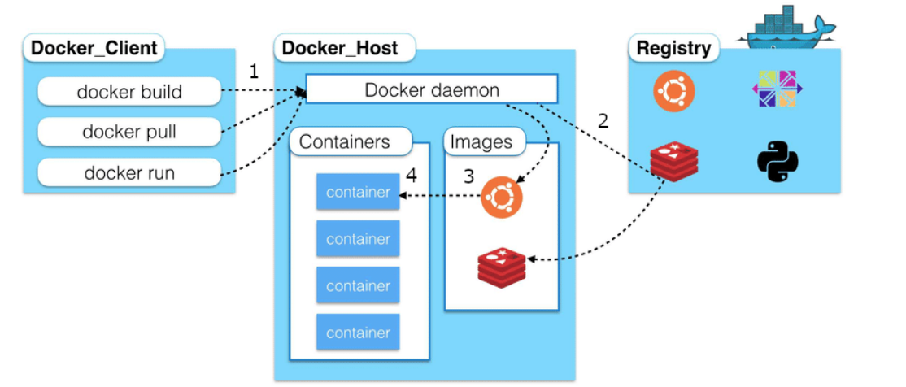

`SOP`

`CORS`

`csrf`

`sql injection`

## `container` and `Docker`  basics

### Intuition

#### `container`

what is container? check this diagram.

#### `Docker`

A `container` runtime to create `container`. 

#### `Docker Daemon`

The **`Docker daemon`** ( dockerd ) listens for **`Docker`** API requests and manages **`Docker`** objects such as images, containers, networks, and volumes. A **`daemon`** can also communicate with other **`daemons`** to manage **`Docker`** services.

#### `Docker image`

A **`Docker image`** is a read-only template that contains a set of instructions for creating a container that can run on the **`Docker`** platform. It provides a convenient way to package up applications and preconfigured server environments, which you can use for your own private use or share publicly with other **`Docker`** users.

[reference here](https://jfrog.com/knowledge-base/a-beginners-guide-to-understanding-and-building-docker-images/#:~:text=A%20Docker%20image%20is%20a,publicly%20with%20other%20Docker%20users.)

### command

- `docker build`, `docker pull` and `docker run`

- `docker ps --format "table {{.Names}}\t{{Image}}"`

