# Network Basic Theory

[TOC]


## start

### LAN and WAN

- `LAN` is local area network, such as in a house.
- `WAN` connects `LAN`s over large geographic distances.


## OSI reference model

### start

Open System Interconnection Reference Model is a reference model (conceptual model) meaning it is not an actual model, it is the base of other actual models.

### layers

There are seven layers:

- Application: not the user interface itself. It involves user applications and end devices which allow users to access the network service.
- Presentation: converts or encodes data into standard format so that receiving computer could understand. For example, text can be encoded as <u>ASCII</u> or <u>HTML</u>, and graphics can be encoded as <u>JPEG</u> or <u>TIFF</u>. 
- Session: The Session layer protocols handle the initiation of a session between processes running on two different hosts. For example, if a host wants to access a web application, a session needs to be established between the host and the workstation hosting the web application, so that the series of related requests are distinguished and separated from others by offering a session id to maintain connections between applications.
- Transport: converts data to a format that can be transmitted over the network.
- Network: takes the segment from Layer 4 and adds a header to it to create a **package**, and then delivering the package to the destination computer. If there are more than one route to the destination computer. the Network Layer chooses the best path for the packet to take. Since the Network Layer treats each packet independently, so it is possible that two packets from the same transmission might take different paths to arrive at the destination computer.
- Data Link: take package from the upper layer and adds another header to form a **frame**.
- Physical

How data flows? In the sending computer, data flows down the stack, each layer encapsulate the data, adding some information. When the data reach the lowest layer, the physical layer, it will be transported through cable or other physical media to the receiving computer. In the receiving computer, data flow up the stack and be decapsulated by each layer.

### TCP/IP model

Layers are:

- Application (merge of Application, Presentation and Session layers in OSI)
- Transport
- Internet (Network layer in OSI)
- Network Access (merge of Data Link and Physical layers in OSI)

### Five-Layer Model

layers:

- Application (merge of Application, Presentation and Session layers in OSI)
- Transport
- Network
- Data Link
- Physical

## Five-Layer model

### start

layers:

- **Application** (merge of Application, Presentation and Session layers in OSI) 
- Transport **(Layer 4)**
- Network **(Layer 3)**
- Data Link  **(Layer 2)**
- Physical **(Layer 1)**

### data flow (sending side)

Assuming that we have a actual data, flows from application layer to the bottom layer - physical layer.

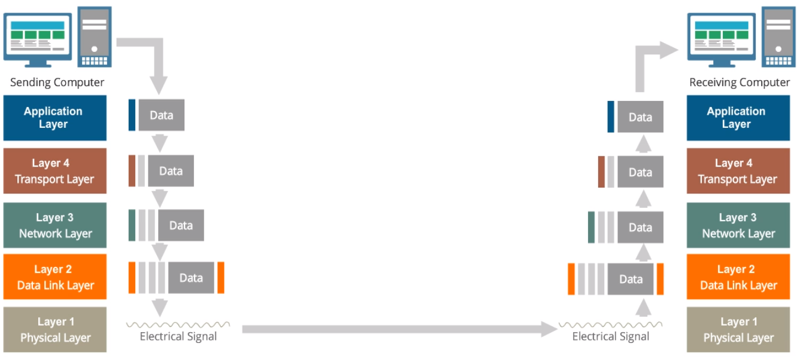

The final data should looks like this:

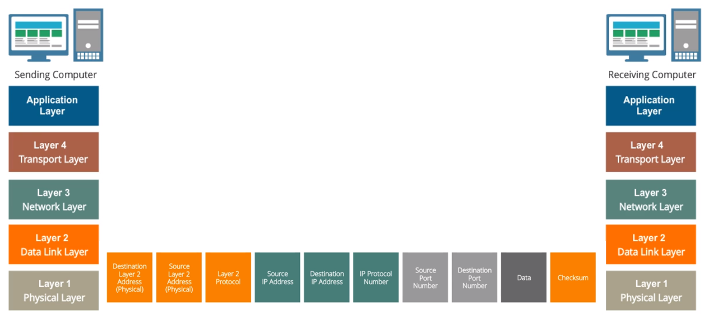

#### Application Layer

- When you send an email. it will be first processed by Application Layer protocol, SMTP.
- This layer specifies how data encoded, compressed or encrypted and how sessions should be managed. Analog: translate the language of this letter to the language that recipient could understand.
- Other Protocols are **HTTP**, **FTP**, **DNS**, **SMTP**.
  - **HTTP**: for the transfer of information on the Internet and the World Wide Web.
  - **FTP**: transfer data or file from one computer to another through a network.
  - **DNS**: bind Domain Name to IP.
  - **SMTP**: sending email

#### Transport Layer

- **Three-way handshake** is needed between the hosts before data transmission begins.
- Receives data from the upper layer and **divides** it into the segments.
- (upper layer protocol) Add **destination soft port number**: specifies the **soft port**, which indicates the **Application Layer protocol** should be used to process the data on the receiving computer.
  - **soft port number** is a unique number assigned to each **Application layer protocol**. So, from this number(port) we can know which **Application Layer protocol** the **Application Layer** use.
  - for example. HTTP is for port 80 and DNS for port 53 SMTP for port 25. So if the soft port number is specified as 25, that means the SMTP protocol will be used in the Application Layer.
-  (upper layer protocol) Add **source soft port number**: records the sending application layer protocol so that the receiving Transport Layer needn't to access to the real data to get it.
- (current layer protocol) Choose a **Transport Layer protocol**: UDP and TCP
  - UDP 
    - no need for receipt, so don't know if the receiver received it.
    - fast and for short message.
    - DNS, Online Game, Voice over IP, Streaming video.
  - TCP
    - need for receipt, error checking and recovery procedures.
    - receiving computer tells the sending computer when the data is received.
    - HTTP, SMTP, FTP.
    - cut data from Application Layer into smaller pieces called segments and use sequence numbers to put segments back in the correct order, if one segment doesn't arrive in time, this segment will be resent.

#### Network Layer

- (upper layer protocol) Add **IP protocol number**: records which **Transport Layer protocol** is used. 
  - Each  **Transport Layer protocol** is assigned an unique identifier or IP protocol number. So from this number the **Transport Layer protocol** could be found.
  - UDP: IP protocol is 17; TCP: IP protocol is 6.
  - It is analogous to the **destination soft port number** and **source soft port number** in **Transport Layer**, both of which record the protocol of the upper layer. But the source of the IP protocol number and the destination of the IP protocol number should be the same.
-  Add **source IP address**:
- Add **destination IP address**:

#### Data Link Layer

- (upper layer protocol) Add **Layer 3 Protocol**: records which **Network Layer protocol** the upper layer use.
- Add **destination layer 2 address** or **MAC address**:
- Add **source layer 2 address** or **MAC address**:
- data integrity check: **checksum** at the end.
- convert the data into ones and zeros of digital communications.

#### Physical Layer

- convert bits into electrical signals and send them across the physical medium.

### data flow (receiving side)

#### Physical Layer

- received electrical signal

#### Data Link Layer

- reassembled bits into a frame.
- validate the checksum, if invalid, dismiss it.
- remove Layer 2 headers and tail.

#### Network Layer

- verify if package has reached the correct IP address
- send it to TCP or UDP protocol
- remove Layer 3 headers

#### Transport Layer

- If TCP:
  - collect all the segments.
  - reassemble the data.
  - send acknowledgement to the sending side indicating the data was received. If sending end didn't receive this acknowledgement it will resend the segment.
  - send it to the correct application layer protocol.

#### Application Layer

- process data using the specified Application Layer protocol.

### data unit

Name of data unit at each level

- Application, Presentation, Session: Data
- Transport Layer: Segment (TPC), Datagram (UDP)
- Network Layer: Packet
- Data Link Layer: Frame
- Physical: Bits

### Ethernet frame

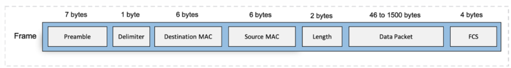

- **Preamble:** The preamble is a series of alternating 1's and 0's. It is used for time synchronization between hosts. The preamble along with the delimiter locates the beginning of a frame.
- **FCS**: Frame check sequence is a 4-bytes field attached to the end of a frame.
  FCS uses a cyclic redundancy check (CRC) algorithm to check for errors in the frame. CRC operates in a way similar to hashing to confirm that the data and the header have not changed during transit.
- **Data Packet:** Contains the data along with the destination and source IP addresses.

### Mac address

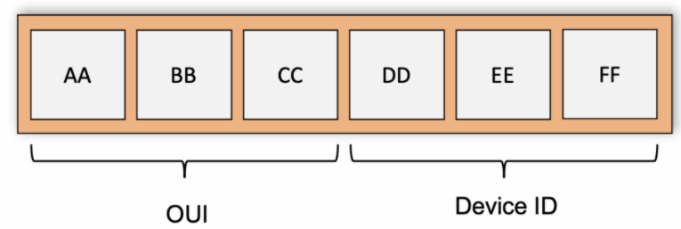

- **OUI**: The first three bytes of a MAC address are called organizationally unique identifier (OUI) and represent the manufacturer ID. For example ACA016 is an OUI for Cisco. Of course, each manufacturer will have a set of OUIs designated to them.

## Routing Model (Layer 3 across the network)

### start

- **MAC address** assigned by the manufacturer is unique. **IP address** is assigned by network administrator.
- **broadcast domains**: Devices in broadcast domain can be reached by broadcast **MAC address**
- broadcast address: `ffff.ffff.ffff`. Every one but the source device in the broadcast domain can receive the message when broadcast address is used.
- In address resolution protocol (ARP), source device use target's IP address to get MAC address. Although IP address is prerequisite for the source device, it still need target's MAC address. This is because in the encapsulation and decapsulation, the layer can't be jump over.
- IP comprises network number and host number, in the same network, the network number should be the same but host number should be unique. While across network the network number is unique but host number could be the same.
- router is a Layer 3 device indicates that it can modify Layer 2 address of the received message
- **boarding table** is maintained by the **switch**, if it can't find the MAC address, it will use ARP to populate it. **route table** is maintained by the **router**.
- **route summarization/ route aggregation** will combine a group of network number into a single route.

### data flow in different cases

Here we use simplified MAC address and IP address, such as `ab` and `1.2` where `1` means the network domain and `2` means host domain

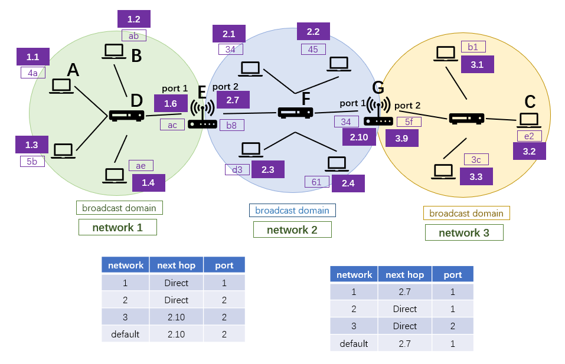

#### broadcast

Use broadcast address `ffff.ffff.ffff`. 

1. source device sends the message whose destination is a broadcast address to all devices.
2. when **bridge** or **switch** get it, they will forward it out of every port except the received one.

#### address resolution protocol (ARP)


Device A and device B are in the same broadcast domain, A knows B's IP address but MAC address.

In this scenario, computer A wants to send message to computer B within the same network.

1. check the IP address to see if in the same broadcast domain. A is 1.1 and B is 1.2, the same network prefix indicates that they are in the same domain or network. 

   To be more specific, with CIDR Notation, if computer A (192.168.1.8/24) wants to send message to computer B (192.168.1.3/24).

   - computer A put source IP address and destination IP address in to the package but **without net mask**.
   - use mask to check if they are in the same network.

2. computer A need to know the MAC address of computer B, so it send a Layer 2 broadcast frame request, asking the MAC address of the device whose IP address is 1.2. Everyone in the network could hear.
   - this Layer 2 broadcast frame request contains:
     - destination Layer 2 address: `ffff.ffff.ffff`. This is a Layer 2 protocol.
     - source Layer 2 address: `4a` This is a Layer 2 protocol.
     - sender's MAC address: `4a`
     - sender's Layer 3 address: `1.1`
     - target Layer 2 address: `0000.0000.0000` indicating it is unknow.
     - target Layer 3 address: `1.2`

3. only computer B will response after checking the target Layer 3 address.
   - this response contains:
     - destination Layer 2 address: `4a` This is a Layer 2 protocol.
     - source Layer 2 address: `ab` This is a Layer 2 protocol.
     - sender's Layer 2 address: `ab`
     - sender's Layer 3 address: `1.2`
     - target Layer 2 address: `4a`
     - target Layer 3 address: `1.1`

4. Then A and B can communicate through MAC address without disturbing others.

#### when router get a package

In this scenario, router E receive a package from port 1.


1. check the MAC address to see if router E is the right recipient. if the destination Layer 2 address in the package is `ac` that means it is right.

2. remove Layer 2 frame such as destination Layer 2 address and source Layer 2 address.

3. inspect Layer 3 information, if the destination IP address is `3.2`, the router E will check the router table and know it needs to be forwarded to next router whose IP address is `2.10` from port 2.

   - A destination IP address might match multiple entries in the routing table since the destination IP address has no mask but in the routing table each entry has a mask. In that way the router will select the match with the longest prefix length.

     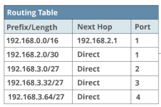

     For example, if the Route get IP address 192.168.3.36 (**pay attention, IP address in the travelling package has no mask**), both Entry 1 and Entry 4 match the prefix but the Entry 4 is the longest, so the Entry 4 will be chosen.

4. add new Layer 2 frame, including destination Layer 2 address (`34`) and source Layer 2 address (`b8`).

#### send data across the network


In this scenario, Computer A send data to Computer C across network.

1. Computer A encapsulate the data from the top of 5-layer model to the bottom.

   - At the Layer 3, source Layer 3 address will be `1.1` and destination will be `3.2`.

   - At the Layer 2, Computer A need to clarify if Computer C is in the same network by check the destination IP address. 

     - computer A put source IP address and destination IP address in to the package but **without net mask**, and then use mask to compare two IP address.

     Obviously they are not in the same network. So it will send the data to its **configured default gateway** / **router**. In this case, the destination Layer 2 address is `ac` and the source is `4a`.

     - if Computer A didn't know the configured default gateway's MAC address yet (already known the IP address of its default gateway because it is configured), it will use ARP to get the MAC address.
     - The default gateway of a PC is either configured by the network administrator or learned dynamically.

   - the data:

     | destination layer 2 address | source layer 2 address | protocol  type | source IP address | destination IP address | IP protocol number | original data | checksum |
     | --------------------------- | ---------------------- | -------------- | ----------------- | ---------------------- | ------------------ | ------------- | -------- |
     | ac                          | 4a                     |                | 1.1               | 3.2                    |                    |               |          |

     

2. Switch D will check the boarding table, or MAC address table which binds the MAC address with the port to decide the exit table. if there is no such MAC address, it will use ARP to get populate the table. In this case, the package will send to Router E.

   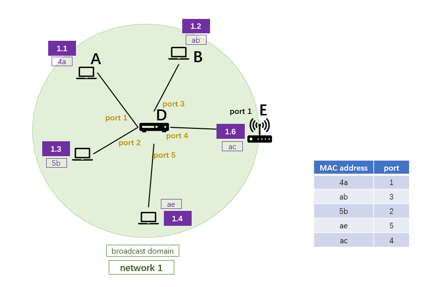

   - Switch D just inspect Layer 2 frame, can't modify Layer 2 frame or check Layer 3 frame.

   - the data:

     | destination layer 2 address | source layer 2 address | protocol  type | source IP address | destination IP address | IP protocol number | original data | checksum |
     | --------------------------- | ---------------------- | -------------- | ----------------- | ---------------------- | ------------------ | ------------- | -------- |
     | ac                          | 4a                     |                | 1.1               | 3.2                    |                    |               |          |

3. what Router E do, see the section "when router get a package". Briefly speaking, remove old Layer 2 address, check the new Layer 2 address and update the Layer 2 address.

   - router can change Layer 2 address and inspect Layer 3 address

   - the data: 

     | destination layer 2 address | source layer 2 address | protocol  type | source IP address | destination IP address | IP protocol number | original data | checksum |
     | --------------------------- | ---------------------- | -------------- | ----------------- | ---------------------- | ------------------ | ------------- | -------- |
     | 34                          | b8                     |                | 1.1               | 3.2                    |                    |               |          |

4. Switch F get the data...

   - the data:

     | destination layer 2 address | source layer 2 address | protocol  type | source IP address | destination IP address | IP protocol number | original data | checksum |
     | --------------------------- | ---------------------- | -------------- | ----------------- | ---------------------- | ------------------ | ------------- | -------- |
     | 34                          | b8                     |                | 1.1               | 3.2                    |                    |               |          |

5. Router G get the data...

   - the data:

     | destination layer 2 address | source layer 2 address | protocol  type | source IP address | destination IP address | IP protocol number | original data | checksum |
     | --------------------------- | ---------------------- | -------------- | ----------------- | ---------------------- | ------------------ | ------------- | -------- |
     | e2                          | 5f                     |                | 1.1               | 3.2                    |                    |               |          |

6. the computer C receive the package, it will decapsulate the package.

   

#### summary

- IP address instructs the update of MAC address.
- While sending a package across the network, IP address always records the ultimate destination but the MAC address only points to the next stop and will be updated by Layer 3 devices such like router.
- If a PC find the destination IP address resides in the same network, it will use ARP to get the MAC address and send the package directly. If doesn't reside in its network, it will send the package to its default configured gateway.
- if a router doesn't know the IP address, it will send the package to the default path of the router table.
- **router** is a Layer 3 device and **switch** is a Layer 2 device. The former could update the MAC address and inspect IP address, the latter could only inspect the MAC address.

### routing protocols

#### OSPF (Open Shortest Path First)

- **Configure**: Each **OSPF-enabled** router sends “Hello” packets out all of its **OSPF-enabled** interfaces to determine if any neighbors exist on those links. If a neighbor is present, then it will try to form an adjacency with it. This way, all the routers in the network form adjacencies with their neighbors.

  - that means you need to configure the interfaces of the router to enable the OSPF protocols.

- **Link-State Database**: link is considered as the interface of a router. Each link has information such as IP address, subnet mask, type of network it is connected to, routers connected to the network. All this information from different links attached to a router form a "Link-State Database."

- **Know the entire topology**: routers will exchange Link-State Advertisements (LSAs) with their neighbor routers. LSAs contain the state and cost of each directly connected link. When all routers in the autonomous system receive all possible LSAs they could understand the entire topology of the network. If there are too many routers or links in a network, routers need more time to learn  the topology, to avoid that, we need to divide an OSPF network domain into smaller sub-domains called areas. 

  All the routers within an area must know the topology of the area to which it belongs, but they do not know about routers in the other areas. Area 0 (also called the **Backbone Area**) has a connection to all the other areas in an autonomous system. All the routing across the areas is managed through the backbone area. Four types of router:

  - **Backbone Router:** Routers in area zero, connects to all other areas.
  - **Internal Routers:** Routers inside an area.
  - **ABR:** Area Border Router is a router located near the border between two different OSPF areas. It connects the backbone network to an OSPF area.
  - **ASBR:** Autonomous System Border Router connects an OSPF area to a network running a different routing protocol.

- **Build Routing Table**: Dijkstra's Shortest Path First algorithm (SPF algorithm) convert the LSDB to SPF tree and then the routing table.


## IP Addressing

### IPv4 

#### IPv4 header format

[click here](https://en.wikipedia.org/wiki/IPv4#Header)

#### Subnetting

- IP address comprises **network prefix** and **host address**
- **net mask** will separate the **IP address** into two parts - network prefix and host address.
- For assigned address range: 192.168.3.0/24. It could be broken down into multiple sub-networks. For example if we subnet it as 192.168.3.0/27, there will be 8 sub-networks and for each of which contains 30 valid host.

#### network number and broadcast address

The first network number should be the network number and the last network number should be the broadcast address.

For example, 192.168.1.0/24, the network number: 192.168.1.0 and the broadcast address: 192.168.1.255. Valid host number: 192.168.1.1 through 192.168.1.254.

To calculate the number of valid hosts:
$$
2^n - 2
$$
where n represents the host bits. In a /24 network, there are 8 host bits.

#### classful routing

- Class A: natural mask: `255.0.0.0`, begin with 0. range: 0-127.
- Class B: natural mask: `255.255.0.0`, begin with 10. range: 128-191
- Class C: natural mask: `255.255.255.0`, begin with 110. range: 192-223

#### loopback interfaces

A device uses the loopback interface to send a message back to itself.

#### MTU and IP Fragmentation

Maximum Transmission Unit (MTU) indicates the longest size of a package that can be sent in a single frame.

If the package is beyond the MTU, the package will be fragmented by the Router. All fragments will be reassembled by Host B.

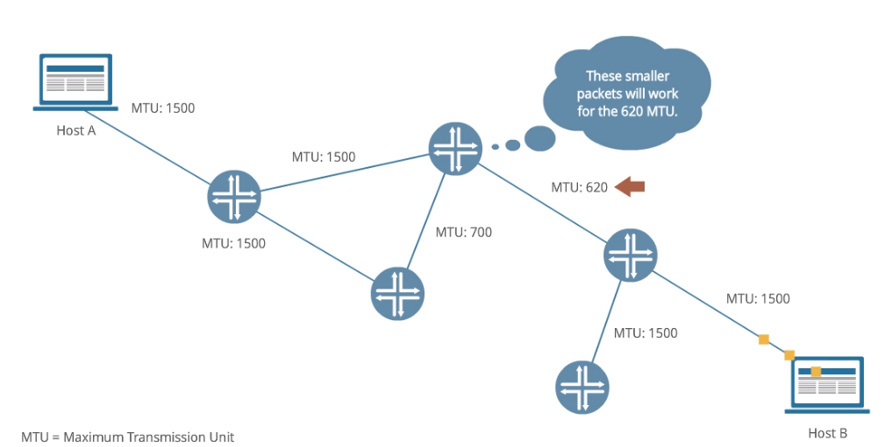

## Traffic Filtering

### Access Control Lists (ACL)

- ACL is a set of rules that controls incoming and outgoing traffic.
- stateless, They look at each packet discretely and do not consider its relationship with the previous packet or compare the two.
- It operates on Layer 3 and Layer 4 of the OSI model.

### Stateful Firewalls

- Stateful firewalls perform stateful inspection, meaning, they compare the incoming traffic with the previous packets and can make decisions based on the sequence of the traffic.
- in a TCP handshake process, if a stateful firewall finds a packet with the ACK bit set to 1, it can recognize that the incoming traffic is part of the TCP handshake process by looking at any of the packets with the ACK bit set to 1.
- Stateful firewalls can operate from Layer 3 up to Layer 7 of the OSI model.

## three-way handshake

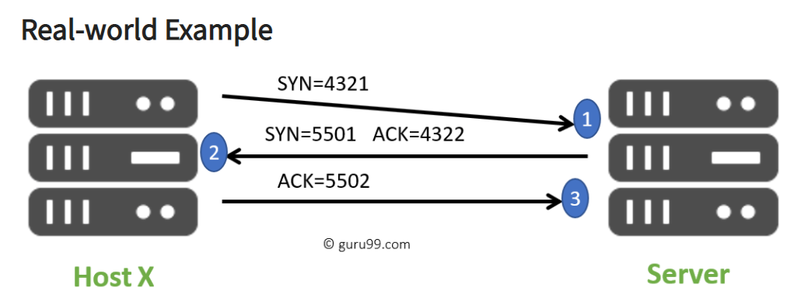

[comes here](https://www.guru99.com/tcp-3-way-handshake.html)

## NF, NFV, NFVI

### start


- NF: Network Function: load balancer, router, firewall, gateway...
- NFV: Network Function Virtualization. How do we virtualize the original network function. It is a process.
- NFVI: Network Function Virtualization Infrastructure.
- VNF: software implementation of a network function: different vendor or different company will have different way to implementing it. There are tangible software asset.
- MANO: Management and Orchestration: Manages the NFVI and VNFs.
- At first we have NF, then we virtualize them (NFV) to get virtualized network functions (VNF) 
- Virtualization Layer just like Virtual Box, Open Stack.

# Learn from Cisco Lab

## start

- Router Interface: you can assume they are the ports of the switch, such as eth1 or eth2 in the topology.

## topology

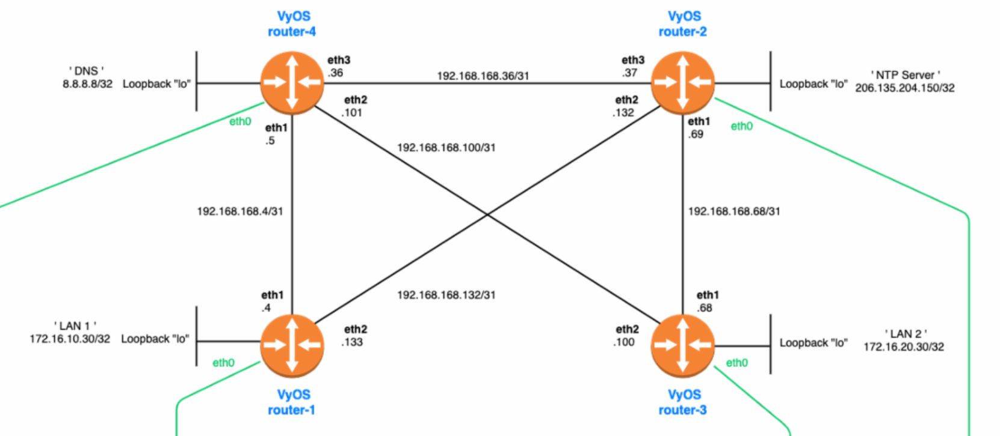

## OSPF

### Lab

#### intuition

tell each router which network you are residing, and it will learn to get a global picture of the entire topology.

#### topology

Here is the Lab result and explanation from Cisco.

The topology of our network


#### step

- In each router:

  ```shell
  configure # into configure mode
  set protocols ospf parameters router-id 1.1.1.x # Set a "router-id" of 1.1.1.X, replacing X with the corresponding router number. For example, 1.1.1.3 would be the router-id of router-3.
  set protocols ospf area 0 network <network>/<netmask> # pay attention, this is the network ip address, not the interface's ip address.
  commit
  save
  exit
  ```

- After configuring

  ```bash
  show ip ospf neighbor # check the result below
  show ip route ospf # check the result below
  ```

#### result and explanation

From the topology, we can category the network into two groups:

1. loopbacks:
   - router-1: `172.16.10.30/32`
   - router-2: `206.135.204.150/32`
   - router-3: `172.16.20.30/32`
   - router-4: `8.8.8.8/32`
2. networks:
   - `192.168.168.4/31`
   - `192.168.168.132/31`
   - `192.168.168.100/31`
   - `192.168.168.68/31`
   - `192.168.168.36/31`

For router-1:

- neighbor

  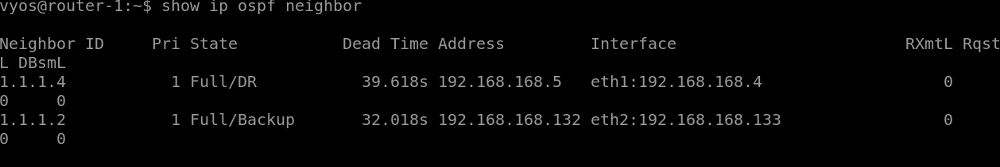

  - from the topology, router-1 connect to router-2 and router-4, so there are two entries.

- IP route

  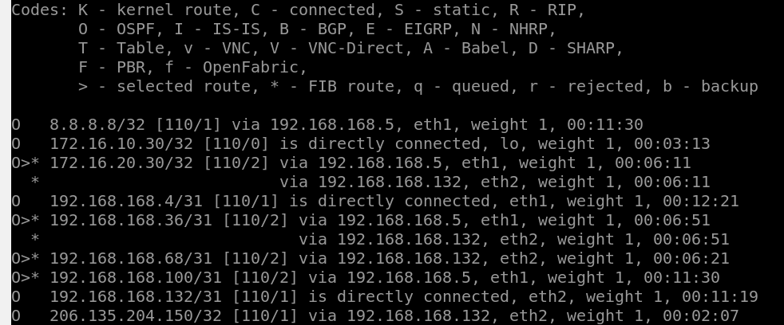

  - router-1 connects to all loopbacks:
    - router-1: `172.16.10.30/32` direct connect
    - router-2: `206.135.204.150/32` redirect connect via router-2's `eth2` whose IP address is `192.168.168.132`
    - router-3: `172.16.20.30/32` redirect connect via router-4's `eht1` or router-2's `eth2`
    - router-4: `8.8.8.8/32` redirect connect via router-4's `eth1`.
  - 5 networks:
    - `192.168.168.4/31`: direct connect, its `eth1` resides in this network.
    - `192.168.168.132/31`: direct connect, its `eth2` resides in this network.
    - `192.168.168.100/31`: via router-4's `eth1`
    - `192.168.168.68/31`: via router-2's `eth2`
    - `192.168.168.36/31`: via router-4's `eht1` or router-2's `eth2`

For router-2:

- neighbor

  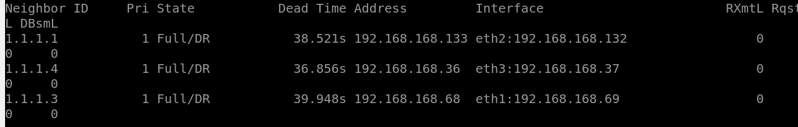

  - from the topology, router-2 connect to router-1, router-3 and router-4, so there are three entries.

- IP route, is similar to router-1's, no more explanation.

  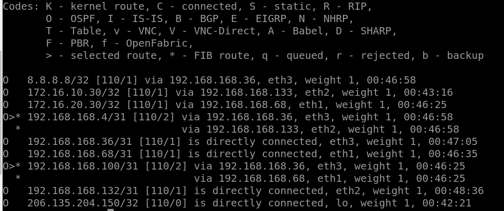


## DNS

### start

Domain Name System (DNS) cover real IP address with name.

We need to connect to a DNS server to parse the DNS name, such as [8.8.8.8](https://www.whatsmydns.net/articles/8-8-8-8.html) as Google's DNS server.

### hierarchy

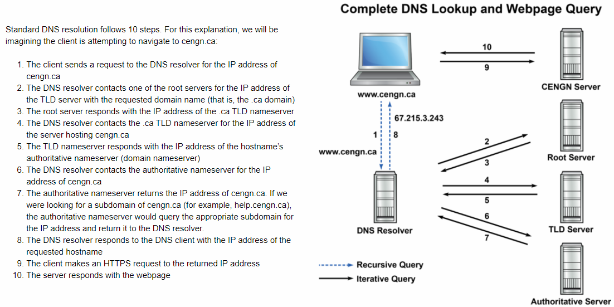

Each server remember the name more and more specific

- for the address `www.example.ca`
- client send the request to the DNS Resolver
- The DNS Resolver asks the Root Server to resolve `.ca` and find the IP address of the TLD Server who stores the `.ca` domain.
- The DNS Resolver asks this TLD Server to get the IP address of Authoritative Server (domain nameserver) who owns the `example` host name.
- The DNS Resolver asks this Authoritative Server to get the IP address of `www.example.ca`. But if the address is `www.help.example.ca`, the Authoritative Server will give the IP address of this subdomain as well.

### DNS: Caching

DNS will save past DNS request in the cache so that next time with the same domain, it needn't to check it again.

TTL to determine the expiration time.

There are several types of DNS caching at different steps of the DNS lookup process:

- Browser DNS caching: Many modern web browsers will cache the IP addresses of past hostnames, meaning the client does not have to query the DNS resolver at all.
- Operation system DNS caching: All OSs have DNS resolvers known as “stub resolvers” which act in the same way as Browser DNS caching.
- Recursive Resolver DNS caching: DNS resolvers also cache IP addresses and will return cached information to bypass communication with the rest of the DNS nameservers.
- Authoritative Server will also have cache: We don't want to bother Root Server and TLD Server as mush cause everybody calls them.

Authoritative nameserver is the final source of truth for DNS records, but for very large domains, there can be additional nameservers responsible for storing subdomain's records. Queries don't always go to the root server or TLD server.

### Lab

We want to configure Router-4 as a DNS server.

- We need to set a DNS router (Router-4) first.

  - In Router-4, map r2loop with Router-2 loopback interface.

    ```bash
    set system static-host-mapping host-name r2loop.local inet 206.135.204.150
    ```

  - configure Router-4 to be a DNS server. and allow all hosts within 192.168.168.0/24 could access to it.

    ```bash
    # Define which hosts are allowed to connect to the DNS server
    set service dns forwarding allow-from 192.168.168.0/24
    
    # Define which address router-4 will listen on
    set service dns forwarding listen-address 8.8.8.8
    
    # On router-4, ping r2loop.local to confirm the hostname resolution works:
    ping r2loop.local
    ```

- In Router-1, set Router-4's loopback (8.8.8.8) as the DNS server

  - ```bash
    # Enter configuration mode
    configure
    
    # Set DNS (name) Server
    set system name-server 8.8.8.8 # router-2's loopback
    
    # ping r2loop.local from Router-1
    ping r2loop.local
    ```

## NTP

- Use UDP 123
- client and server must have NTPD daemon installed
- Stratum 1 is not public. 2-15 could be used to synchronize.