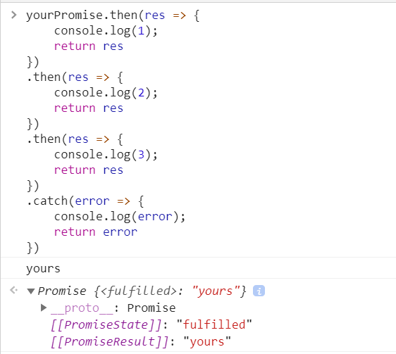

# JavaScript

## Data Type

### convert `array` to `object`

```javascript
const arr = ['a','b','c'];
const res = arr.reduce((acc,curr)=> (acc[curr]='',acc),{});
# {a:'', b:'', c:''};
```

- Each time of the loop `curr` inserted into accumulator `acc[curr] = ''` like this. 
- `acc` is returning the accumulator once loop end. 
- `{}` initial value of the `acc`.

## asynchronous

### callback function


### `Promise`

#### define a `Promise`

`promise` is a class, who has two attributes, `PromiseStatus` and `PromiseValue`.  

We define `promise` in this way with two function handles: `resolve` and `reject`, whose name could be modified but the position can't be changed.

```javascript
const promise = new Promise((resolve, reject) => {
    ...
    if(){
        resolve("resolved");
    }
    else{
        reject("rejected")
    }
})
```

- `resolve` and `reject` are two function handles. 
- `resolve` set `PromiseStatus` into `fulfilled` and load "resolved" into `PromiseResult`
- `reject` set `PromiseStatus` into `rejected` and load "rejected" into `PromiseResult`

check this image:

 

- The error shows that here is no `catch()` for `yourPromise`.

#### `then`

`then` is a method of `Promise` which can be used after a `Promise`. `then` returns a `Promise` as well.

We will use `then` in this way:

```javascript
const promise = new Promise((resolve, reject) => {
    ...
    if(){
        resolve("resolved");
    }
    else{
        reject("rejected")
    }
})
promise.then(res => {
    // handle with res if PromiseStatus = fulfilled
},
            rej => {
    // handle with rej if PromiseStatus = rejected
})
```

- The `.then()` method takes up to two arguments; the first argument is a callback function for the resolved case of the promise, and the second argument is a callback function for the rejected case.
- The `.then()` will first check the `PromiseStatus`  of the `Promise`, if it is `fulfilled`, then execute resolve function, if it is `rejected`, then execute reject function.
- After that, the `then()` create a `Promise`

check the picture:


-  `PromiseState` of `myPromise` is `fulfilled` and `yourPromise` is `rejected`. so in the first case, `resolve` function is called and in the second case, `reject` function is executed.

- ```javascript
  res => console.log(res) // resolve callback function
  rej => console.error(rej) // reject callback function
  ```

- `res` and `rej` are the `PromiseResult` of the previous `Promise`.

- the `then()` will return a `Promise`, in these two cases, both `PromiseState` are `fulfilled` and both `PromiseResult` are `undefined` since we didn't return anything.

check this picture:


- in these two cases, since we return `res` or `rej`, the  `PromiseResult` of the new `Promise` is filled.

The `then()` could have only one argument - a `resolve` function handle without a `reject` function handle, here we annotate it as `then(res)`. If so, a `rejected` Promise will be omitted by all `then(res)`in the `Promise` chain until the final `.catch()`. 


#### `catch`

Just like one argument `then()` who just focus on `resolved Promise`, the `catch()` only pay attention to the `rejected Promise`. The `catch()`returns a `Promise`.


#### `Promise` chain

By use one argument `then()` and `catch()` , we can form a `Promise` chain, code like this:

```javascript
promise.then(res => ...).then(res => ...).then(res => ...).catch(error => ...)
```

- the `rejected Promise` will be omitted by the next `then()` until received by the `catch()`



- `yourPromise` is a `rejected Promise`, only the last `catch()` is trigged.


- `myPromise` is a `fulfilled Promise` all but the `catch()` will be executed

#### asynchronous

We use `setTimeout()` to stimulate asynchronous `Promise`.

- create a Promise

  

  - `herPromise` will call `resolve` 20 seconds later, so at first it is `pending` until the `resolve` is called.

- create a chain

  

  - at first the initial  `Promise` is still `pending`, so then will wait until the `Promise` change to `resolved`.
  - set an 8-second `Timer A` and hang the print 1.1.
  - print 1.
  - set an 1-second `Timer B` and hang the print 2.2.
  - print 2.
  - `Timer B`'s time is up, print 2.2.
  - `Time A`'s time is up, print 1.1.

- unfair for `Promise`

  

  - `hisPromise` executes after `console.log("hello")`.

