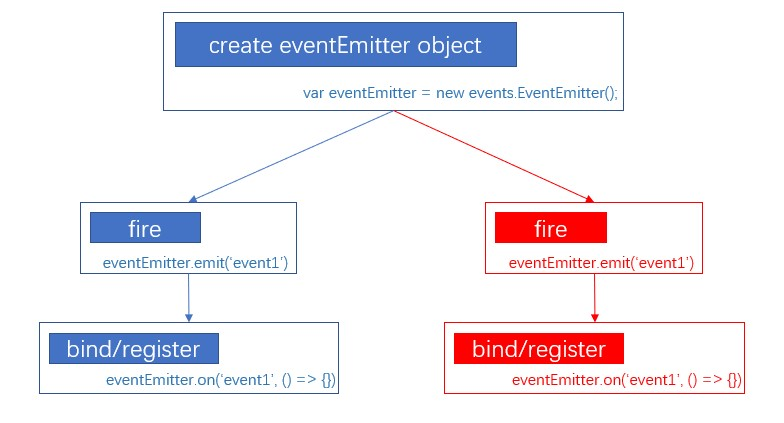
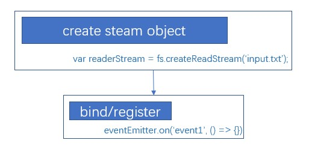

# Node.Js

## events



## stream

### readStream



# Express

## start

1. install node.js first.

2. create a global express generator.

   ```shell
   npm install -g express-generator
   ```

3. create a new application.

   ```shell
   express --view=pug <myappName>
   ```

4. install dependencies.

   ```shell
   npm install
   ```

5. start the server

   ```shell
   npm start
   ```

   
