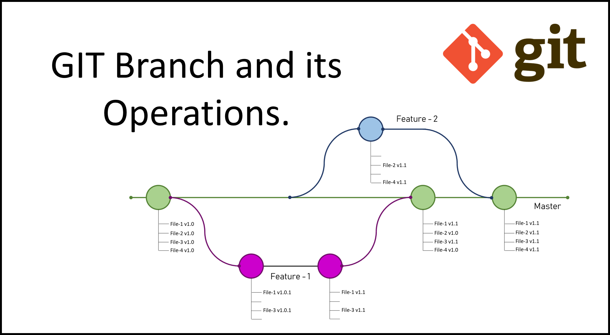

# Git

## start

Two main components of `git` are branch and state.

You can change state on different branch.

## state

## branch

- create a new branch and switch to that: `git checkout -b [name_of_your_new_branch]`

## scenario

### remove the file from the remote repo

- current state: this file has been added, commit and push to the remote repo.
- remove it from your local filesystem, 
  1. use `git rm [fileName]`
     - use `git status`, this file is indicated as `deleted` with green color, meaning that this operation (including "delete" keyword with the file name) has been added into `staging state`, but still need to be committed. 
     - but still exists in the remote git repo.
  2. `git commit -m "deleted the file in the local file system"`
  3. `git push -u origin`
  4. after that, if you use `git status`, this file will be disappeared.
- remove it from local git repo, which means keep it in the local filesystem but swift its `state` from `local repository` to `staging`.
  1. use `git rm --cached [fileName]`.
     - use `git status`, this file is indicated as `deleted` with green color, meaning that this operation (including "delete" keyword with the file name) has been added into `staging state`, but still need to be committed. 
     - but still exists in the remote git repo and local filesystem.
  2. `git commit -m "deleted the file in the local file system"`
  3. `git push -u origin`
  4. after that, if you use `git status`, this file will be shown as `untracked files`.

### update other branches based after changing something in the master branch

if you have two branches (master and b1), you realized you have something to change on branch master that should be in all other branches....

[rebase or merge](https://stackoverflow.com/questions/3876977/update-git-branches-from-master)

### update master branch after merge two branches in the remote.

[git pull <remote>](https://www.atlassian.com/git/tutorials/syncing/git-pull)

### How do I undo 'git add' before commit

[git reset <file>](https://stackoverflow.com/questions/348170/how-do-i-undo-git-add-before-commit)

### Check and update the remote URL

`git config --get remote.origin.url` 

`git remote -v`

`git remote set-url origin git@gitserver.com:user/repo_name.git`

## reference

[git_tutorial](https://unwiredlearning.com/blog/git-basic-for-beginners/)