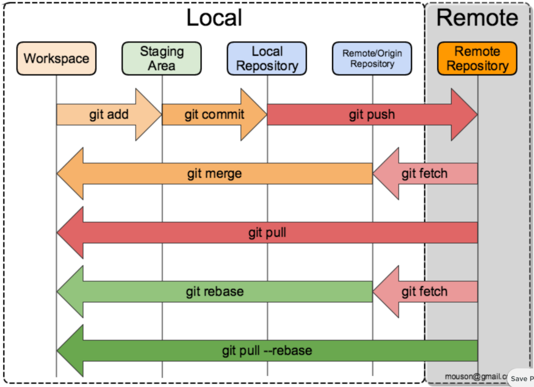

# Theoretical Knowledge

## start

- Git is an open source **distributed revision control system**. It is mainly used for version/revision control in software development, specifically for controlling the source code. Git makes it easy for developers to collaborate and work as a group.
- **a series of snapshots**: Every time a user commits or saves the state of their project with git, it takes a snapshot of that file state and stores the reference of that snapshot.
- Two main components of `git` are branch and state.
- You can change state on different branch.

## state




## branch


- create a new branch and switch to that: `git checkout -b [name_of_your_new_branch]`

# Practice

## first step

```shell
git init
```


## confirm their identity

```shell
git config --global user.email user@email.com
git config --global user.name “user name”
```

## add remote

```shell
git remote add origin https://ADDRESSOFTHEREPO
```


## remove the file from the remote repo

- current state: this file has been added, commit and push to the remote repo.
- remove it from your local filesystem (warning: you will delete it not only in the git, but also from the folder), 
  1. use `git rm [fileName]`
     - use `git status`, this file is indicated as `deleted` with green color, meaning that this operation (including "delete" keyword with the file name) has been added into `staging state`, but still need to be committed. 
     - but still exists in the remote git repo.
  2. `git commit -m "deleted the file in the local file system"`
  3. `git push -u origin`
  4. after that, if you use `git status`, this file will be disappeared.
- remove it from local git repo, which means keep it in the local filesystem but swift its `state` from `local repository` to `staging`.
  1. use `git rm --cached [fileName]`.
     - use `git status`, this file is indicated as `deleted` with green color, meaning that this operation (including "delete" keyword with the file name) has been added into `staging state`, but still need to be committed. 
     - but still exists in the remote git repo and local filesystem.
  2. `git commit -m "deleted the file in the local file system"`
  3. `git push -u origin`
  4. after that, if you use `git status`, this file will be shown as `untracked files`.
  5. better to add it in the `.gitignore`.

## update other branches based after changing something in the master branch

if you have two branches (master and b1), you realized you have something to change on branch master that should be in all other branches....

[rebase or merge](https://stackoverflow.com/questions/3876977/update-git-branches-from-master)

## update master branch after merge two branches in the remote.

[git pull <remote>](https://www.atlassian.com/git/tutorials/syncing/git-pull)

## How do I undo 'git add' before commit

[git reset <file>](https://stackoverflow.com/questions/348170/how-do-i-undo-git-add-before-commit)

## Check and update the remote URL

`git config --get remote.origin.url` 

`git remote -v`

`git remote set-url origin git@gitserver.com:user/repo_name.git`

## reference

[git_tutorial](https://unwiredlearning.com/blog/git-basic-for-beginners/)