## Configure EC2 environment

### create an IAM user

You can create an IAM role whose policy is `AmazonS3FullAccess`.

### configure the environment

#### for the backend

`sudo apt install openjdk-8-jre-headless`.

before install, please confirm the local environment by `File` => `Project Structure` => `Project Settings` => `Project` to check the project SDK is 1.8.

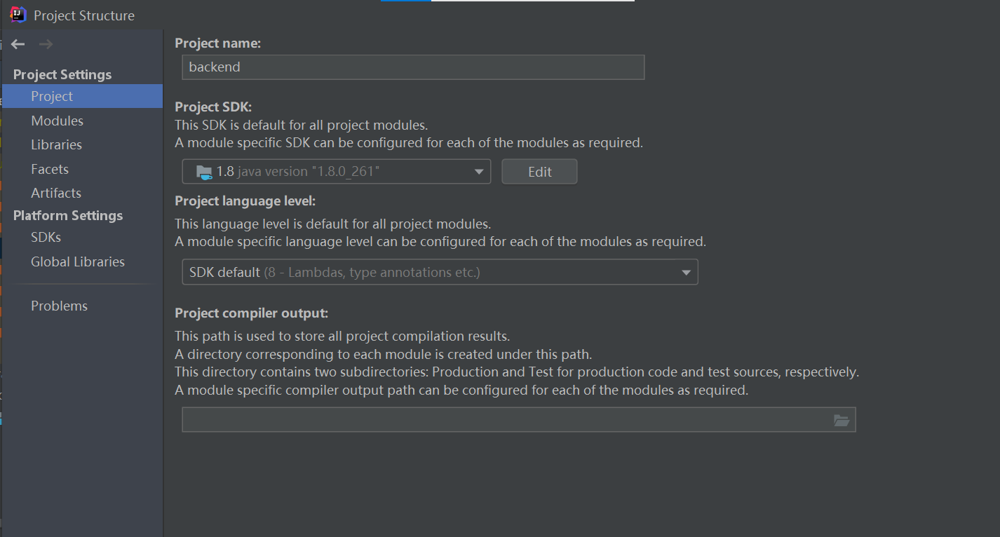

#### for the frontend

1. install Nginx `sudo apt install nginx`

2. go to `/etc/nginx/sites-available/default`, find root `/var/www/html`, frontend project should be put here, also fill this root path in the `Deployment` => `Connection` => Root path

   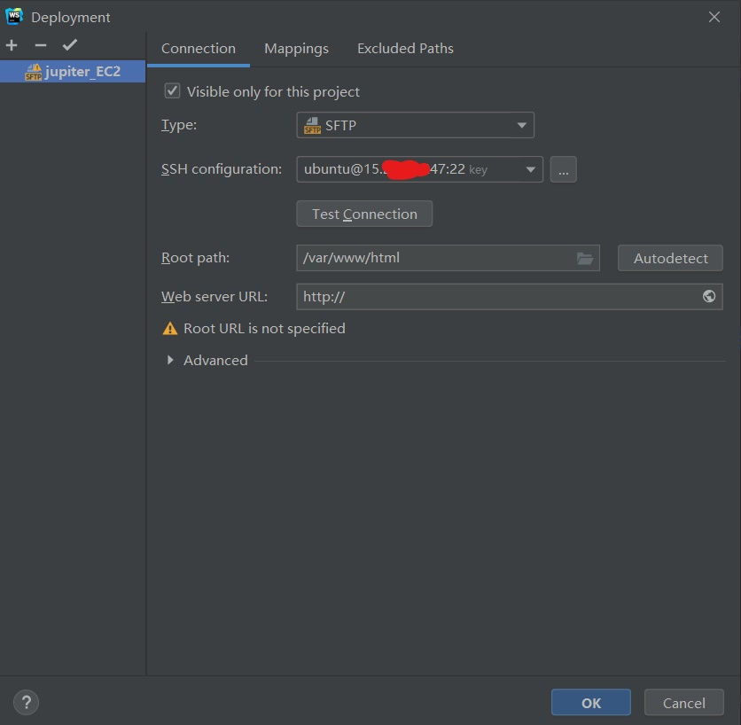

3. add `location` and `location /v1` in the file

   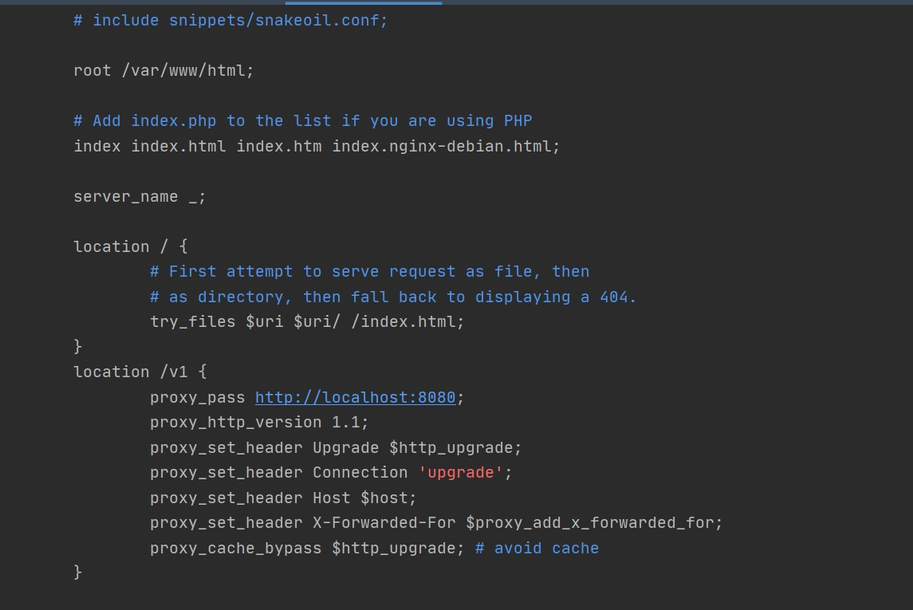

   - For **`location`**, assuming that there are two Router, the Nginx Router will direct URL to the folder or file under the root path, But in the `ReactJs`, we also have another Router library`<Router> </Router>` which will be effective only when the program is in the deployed project. so here is the conflict, when use URL, Nginx will try to find the specified file under `/var/www/html` folder since it is the root folder, but URL also use to direct `Reactjs` Router to find the right page, so When need to use this command `location / {try_files $uri $uri/ /index.html;}` to force the URL in the `index.html`, so that `ReactJs` Router could work.
   - For **`location /v1`**, it is a proxy for the frontend fetch to find the backend API.

4. `sudo service nginx restart`

5. open 80 port in EC2

6. upload build package to the remote host

7. use `http` not `https`.

## backend via IntelliJ

### configure IntelliJ

1. **get key-pair file**: get `key-pair.pem` from EC2 instance.

2. **configure the connection**: In IntelliJ, click `Tools` => `Deployment` => `Configuration`..., 

   - in the `Connection` tag, upload the `.pem` file in SSH configuration:

     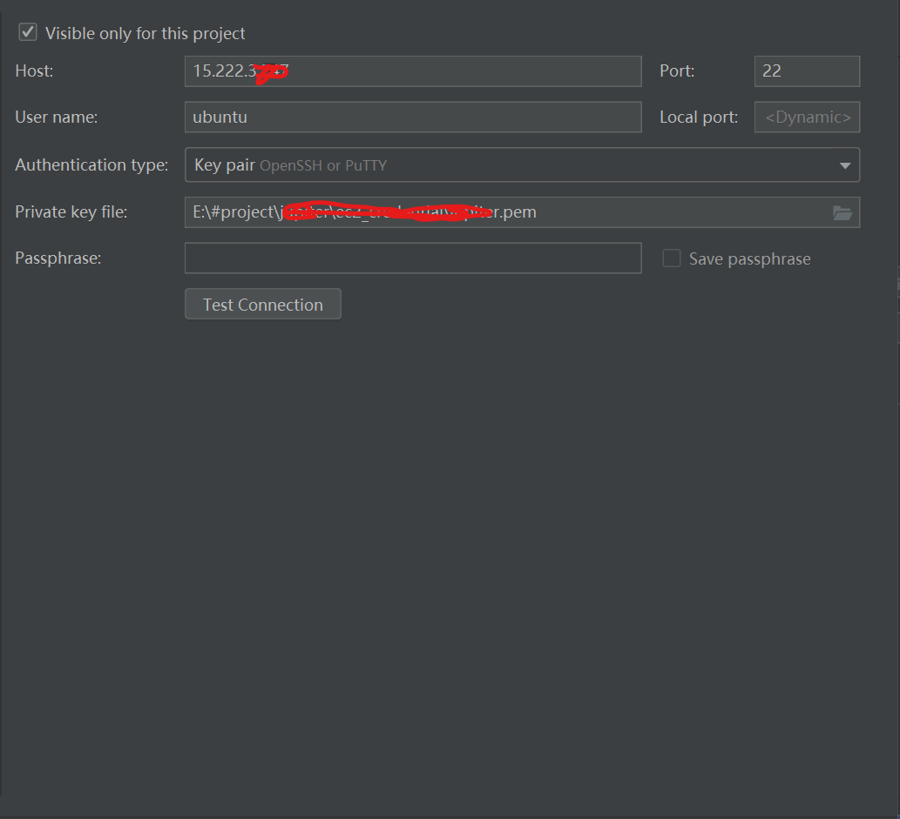

   - in the `Connection` tag:

     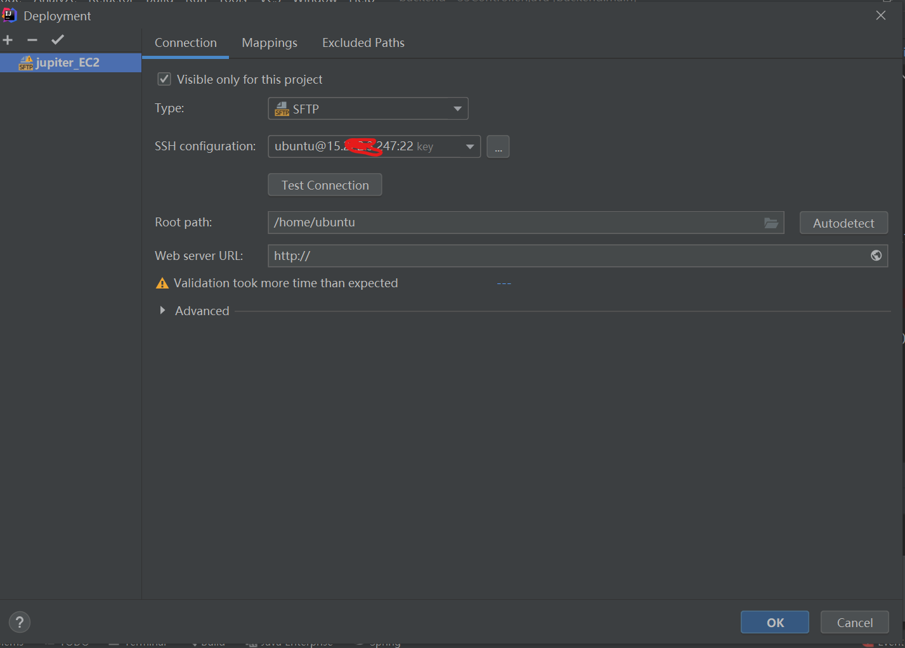

   - in the `Mapping` tag:

     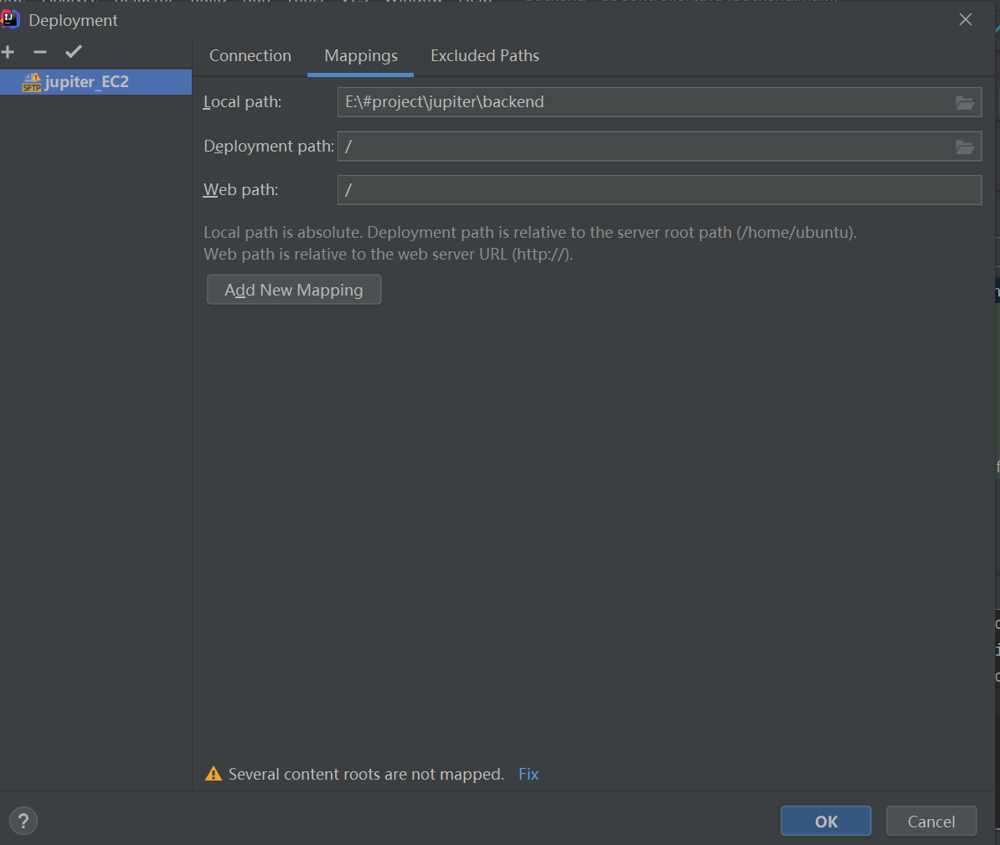

   - pay attention, the Deployment path is a relative path regarding Root path in the Connection tag, when you add this Deployment path, it will tell IntelliJ to upload file into this path. The background color of the Deployment path in Remote Host catalog will become yellow.

     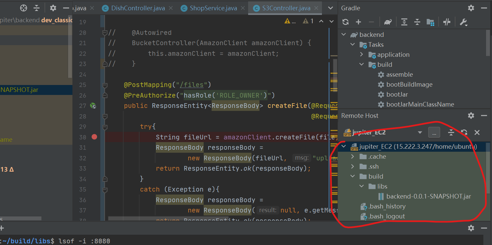

3. **connect to the remote server**: `Tools`=> `Start SSH Session...` if succeed, you will see this remote server panel:

   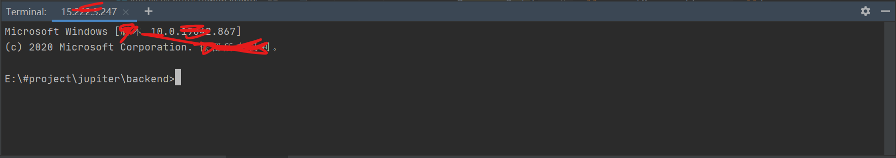

### build the project

We need to find `Gradle` in the right panel, locates at `Tasks` => `build` => `build` button to build the project.

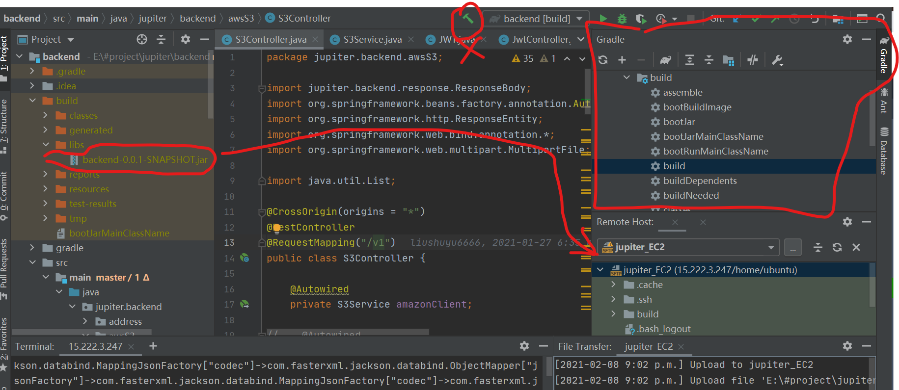

### **upload the .jar file**

when finish building, you will get a .jar file under the `build/libs` folder. Upload it to the remote server.

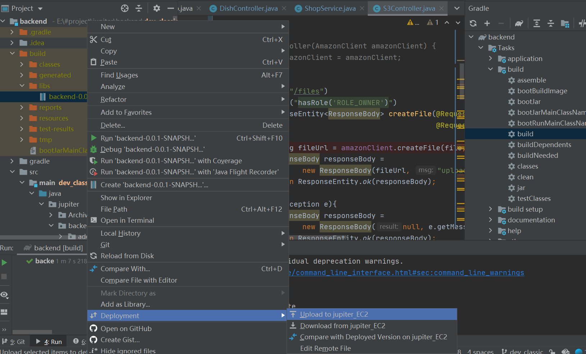

### run this .jar file

If you have already configured the EC2 environment, run the .jar via `java -jar backend-0.0.1-SNAPSHOT.jar` under `~/build/libs` in the remote server. This process will re-run even if you kill if you have already run the daemon.

If there is something run on the 8080 port: 

- find the process `lsof -i :8080` and the PID number.
- kill the process `sudo kill -9 [PID]`.
- if you already deployed the `.jar` before and this is the second time that you want to update the `.jar` file, just kill the process and it will re-run several seconds later if you have already use daemon.

### run the daemon in the background

your need to configure the `[yourProjectName].service`, use `sudo vim /etc/systemd/system/jupiter.service` since my project's name is `jupiter`.

: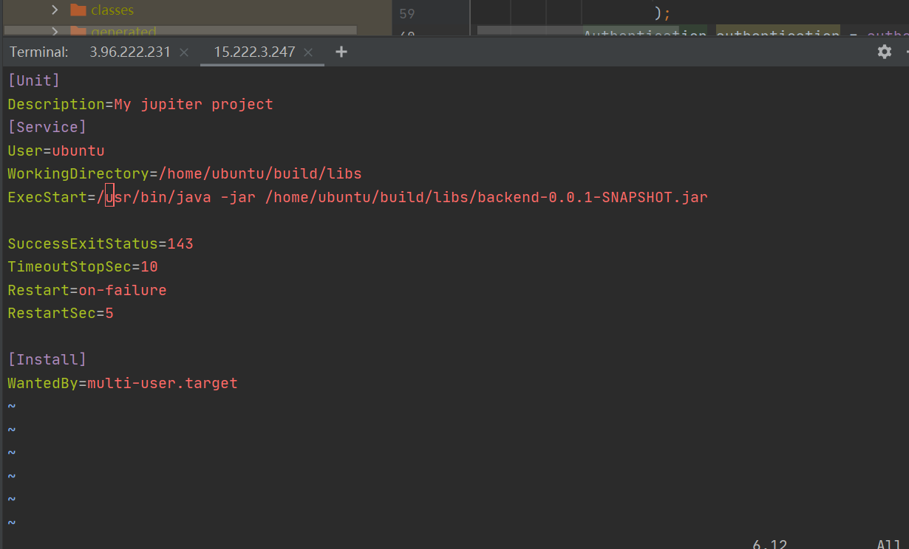

- `WorkingDirectory`: is the place where your `.jar` file locates.
- `ExecStart`: the execute command that you use to run the `.jar` file. But the java path should be full path, get your java path through `which java`.

After configuring, use you need to restart the daemon using the following command in sequence:

- `sudo systemctl daemon-reload`
- `sudo systemctl enable [yourProjectName].service`
- `sudo systemctl start [yourProjectName].service`
- `sudo systemctl status [yourProjectName].service`

### update the .jar file

- need to find the PID and kill the process first, back to "run this .jar file" chapter.

## frontend via WebStorm

### configure WebStorm

The same as IntelliJ, just post images:

1. 
2. 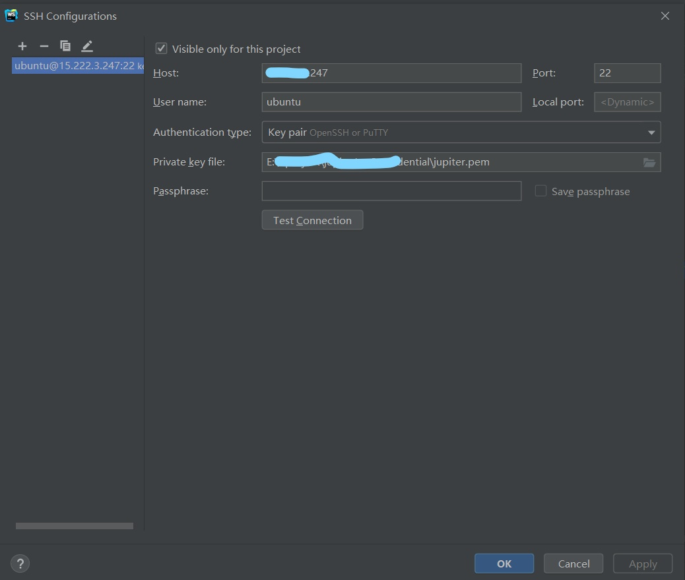
3. 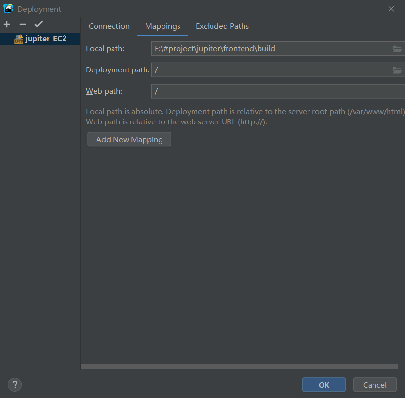
4. 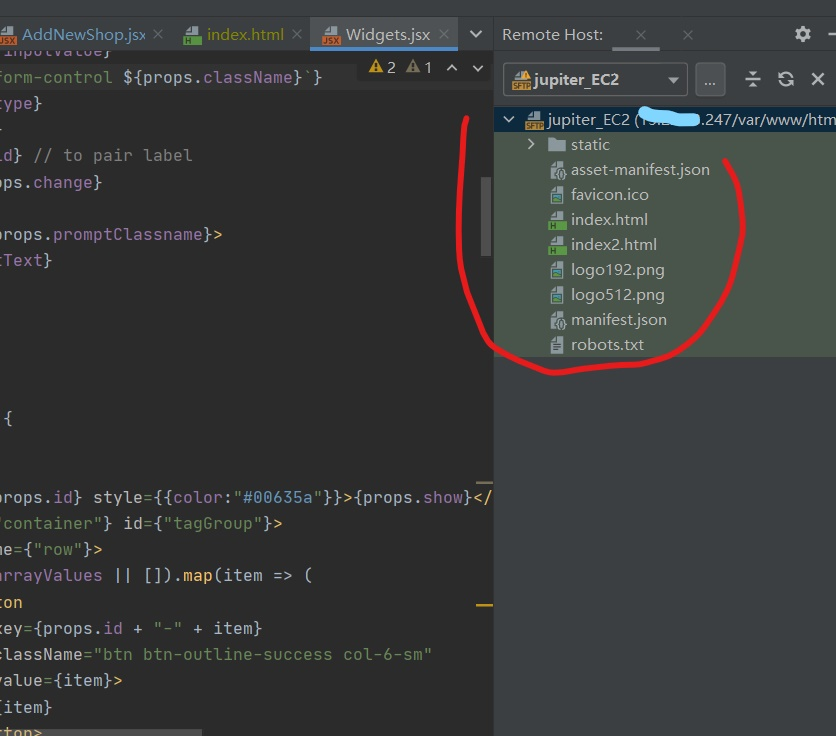
5. 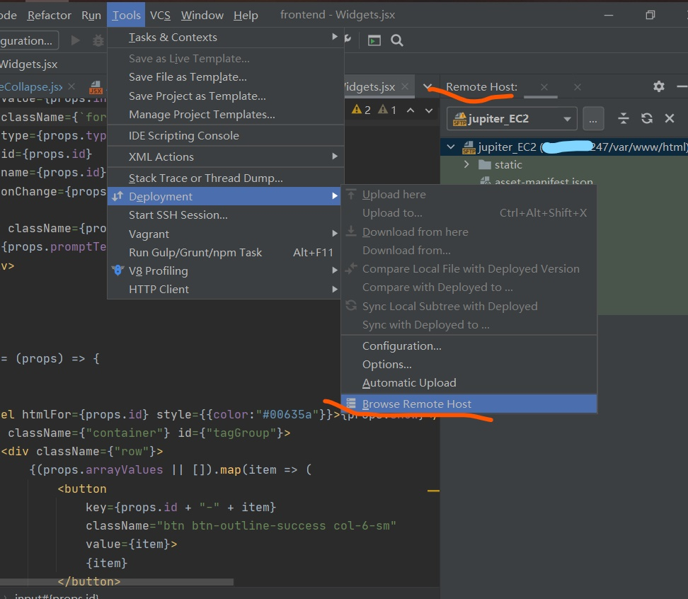

### build the project

Build the project via `npm run build`, then a build folder will appear, just need to upload this folder to the remote.

### upload the `/build`

upload the `/build` folder to `/var/www/html`.