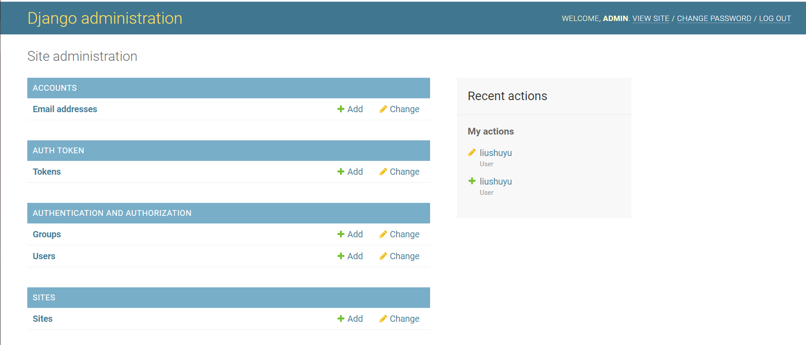

## Django + REST + Mongo

### dependencies

In the command line, under the `(venv)`

- ```shell
  (venv) >pip install djangorestframework
  ```

- ```shell
  (venv) >pip install django-rest-knox
  ```

- install `djongo`

  ```shell
  (venv) >pip install djongo
  ```

- install `dnspython.py`, to connect to the `mongodb+srv://`.

  ```shell
  (venv) >pip install dnspython
  ```

- install `django-cors-headers` for cross-origin

  ```shell
  (venv) >pip install django-cors-headers
  ```


### setup Django project

```shell
django-admin startproject <yourProjectName>
```

### migrate and set super user

- migrate first.
- then  `python manage.py createsuperuser` to create a super user.
- create other users from `/admin`.

### install `auth`

[django-rest-framework](https://www.django-rest-framework.org/#installation) and [install django-rest-auth](https://django-rest-auth.readthedocs.io/en/latest/installation.html), both of them need to be configured.

- install packages

  ```python
  (venv) >pip install django-rest-auth
  (venv) >pip install django-rest-auth[with_social]
  ```

- `setting.py` including authentication and permission.

  ```python
  INSTALLED_APPS = [
      'django.contrib.admin',
      'django.contrib.auth',
      'django.contrib.contenttypes',
      'django.contrib.sessions',
      'django.contrib.messages',
      'django.contrib.staticfiles',
      'rest_framework',
      'rest_framework.authtoken',
      'rest_auth',
      'django.contrib.sites',
      'allauth',
      'allauth.account',
      'rest_auth.registration',
  ]
  
  SITE_ID=1
  
  REST_FRAMEWORK = {
      # Use Django's standard `django.contrib.auth` permissions,
      # or allow read-only access for unauthenticated users.
      'DEFAULT_AUTHENTICATION_CLASSES': [
          'rest_framework.authentication.BasicAuthentication',
          'rest_framework.authentication.SessionAuthentication',
      ],
      'DEFAULT_PERMISSION_CLASSES': [
          'rest_framework.permissions.DjangoModelPermissionsOrAnonReadOnly'
      ]
  }
  ```

- `urls.py`

  ```python
  urlpatterns = [
      path('admin/', admin.site.urls),
      path('api-auth/', include('rest_framework.urls')),
      path('rest-auth/', include('rest_auth.urls')),
      path('rest-auth/registration/', include('rest_auth.registration.urls'))
  ]
  ```

- after that, the `/admin` page will look like this one, not only `Authentication and authorization` entry, but three more entries.

  

### start application

start application by `manage.py`

- ```shell
  (venv) >python manage.py startapp lobby
  ```

- don't forget to add the `app` in `setting.py`.

### add `urls.py` and `views.py` in the application

- `urls.py`: like router in Spring Boot
- `views.py`: tell the server how to handle with the request, don't forget to add permission
- don't forget to configure `urls.py` 

## authentication and authorization

## hierarchy

To make things clear and easy to understand, assuming that the project's name is Mercury and the application name is app

In the Mercury Project

- Mercury/  this is a manager
  - `__init__.py`
  - asgi.py
  - settings.py: add your application name and `rest_framework` dependencies
  - urls.py configure `urls`
  - wsgi.py
- app/
  - models.py: define the table in the database, need to use`(venv)python manage.py makemigrations` to generate such as `0001_initial.py` in the migrations folder.
  - migrations/
    - `__init__.py`
    - `0001_initial.py` use `makemigration` to generate this file. direct how to create table in the database
  - api/
    - urls.py: like a router in Spring Boot, to redirect the url.
    - views.py: implementation the request, such as return messages or render some pages.
  - `__init__.py`
  - admin.py
  - apps.py
  - tests.py
- manage.py use this one to generate application, as well as `makemigrations`
- `venv` 

## terms

### `serializer`

- `Serializer`: We need to translate a model instance into `serializer` first and then we render it into `json`.
- `Deserializer`: First we parse a stream into Python native datatypes and the restore it.


## HTTP Request


## models


## `ViewSet`

- Just like controller in Spring Boot


- we have class based view and function based view


## reference

[this tutorial](https://bezkoder.com/django-mongodb-crud-rest-framework/)

[youtube Django Rest Framework API tutorial series](https://www.youtube.com/watch?v=iIqMEflK-HM&list=PLmDLs7JbXWNjr5vyJhfGu69sowgIUl8z5&index=1)


# Instruction

## super user and admin panel

## Authentication and Permission API

Permission is just like Authorization!

### authentication, including register, login, logout, etc...

We need to install both  [`authentication`](https://django-rest-auth.readthedocs.io/en/latest/installation.html) and [registration](https://django-rest-auth.readthedocs.io/en/latest/installation.html#registration-optional) from `django-rest-auth`. Follow their instructions. Then you will have multiple APIs:

- `/rest-auth/registration/`: 
  - register a new user (before that you have already created a super user). more [here](https://django-rest-auth.readthedocs.io/en/latest/api_endpoints.html#registration).
  - We login from the `/admin` page, you will see the user that you just registered with a token in the `AUTH TOKEN` entry. Pay attention, you need to use the `admin` user (a user has `admin` privilege) to login through `/admin` page, not this just registered user.
- `/rest-auth/login/`: 
  - when login, you can get the key (token), but you can't really login to the `/admin` page. 
- `/rest-auth/logout/`:
  - logout
- more APIs [here](https://django-rest-auth.readthedocs.io/en/latest/api_endpoints.html#api-endpoints)


## Handle with URL

### parameters in the URL

- URL: `http://127.0.0.1:8000/tutorial/first/?id=11234`

- In the code:

  ```python
  print(request.query_params)
  ```

  

## Models


### migration

- make migration, they you will find a new file named `0001_initial.py` under  the migrations folder
- migrate it.
- register it in the `admin.py` see that we can see it in our admin panel