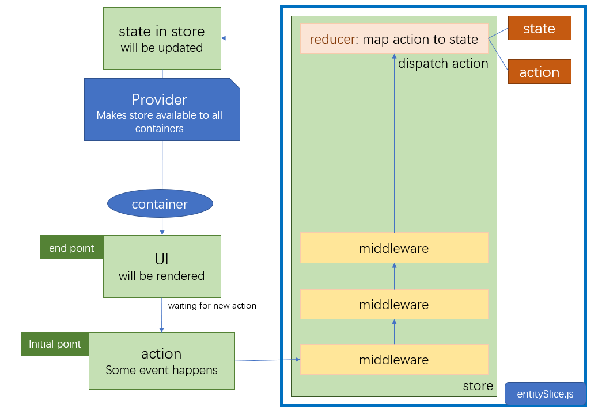
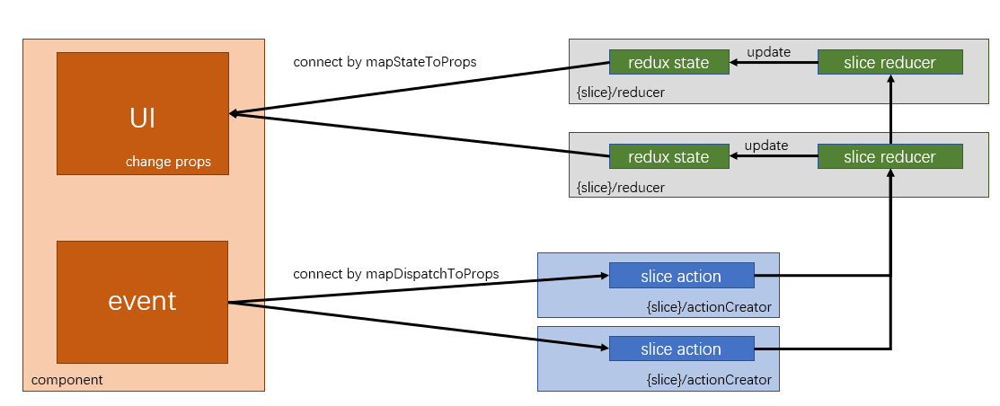
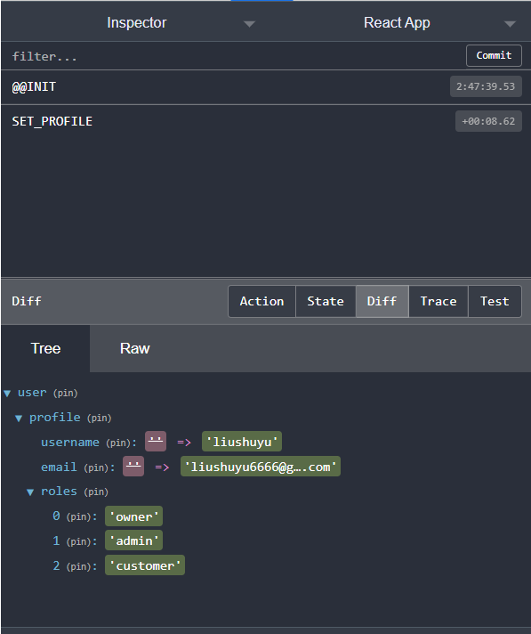

# Redux Theory

[TOC]


## intuition



## start and run

You need to install two package in the project, `npm install redux` ， `npm install react-redux` and `npm install redux-thunk`.

- `redux` is the core library
- `react-redux` binds react and redux together, separating from redux core library. The original redux will not update UI automatically when `state` updates, so this library is needed to subscribe to the store and efficiently update the UI as `state` changes<sup>[ref](https://redux.js.org/tutorials/fundamentals/part-5-ui-react#basic-redux-and-ui-integration)</sup>.
- `redux-devtools-extension` use `redux devtools` to debug.
- `redux-thunk` handles with asynchronous actions such as `fetch`.

Then `npm start` , or `npm install react-scripts` if `react-scripts` package is missed.


## entities

### action

An object containing a `type` field, describes what happened, looks like this `{type: 'todos/todoAdded', payload: todoText}`. Even if we use sliced reducer (eg: `userReducer`, `shopReducer`), action will also go through all these reducer.

### reducer

Updates the `redux state` when a certain action happens by using `switch case` snippet or something else.

The input arguments are `state` and `action`.

#### functions

- `combineReducers`


### store

The core of the `redux` , store decides how to handle with actions and update state. It will first dispatch the `action`, and update the `state` according to the actions.

#### functions

- `store.getState` retrieve current states from the state tree

- `store.dispatch` trigger the reducer to update the state

- `store.subscribe` a callback function returning a function to cancel itself. When `state` update, the `store.subscribe` will be triggered to execute. [check the usage here](https://redux.js.org/tutorials/fundamentals/part-4-store#dispatching-actions), also see the code snippet: 

  ```javascript
  // any time when the state update, print
  const unsubscribe = store.subscribe(() =>
      console.log("state after dispatch: ", store.getState())
  );
  
  store.dispatch({type: "todos/todoAdded", payload: "learn about actions"})
  // something else ...
  
  // stop printing anything
  unsubscribe();
  ```

- `createStore` [click here](https://redux.js.org/tutorials/fundamentals/part-4-store#creating-a-store)

### enhancer

[enhancer tutorial](https://redux.js.org/tutorials/fundamentals/part-4-store#configuring-the-store)

When applying on the `store.dispatch`, wraps the `action` to expect more rather than just update the specified `state` when a certain action or event happens.


### middleware

[middleware tutorial](https://redux.js.org/tutorials/fundamentals/part-4-store#middleware)

To extend the `store.dispacth` function using a pipeline, where the original `store.dispatch` locates at the end of the pipeline.

Just like a powerful `reducer` , middleware can do more than `reducer`.

Hierarchy of `middleware` :

1. outer layer: `store`, including the `middleware` pipeline, `reducer` and `preloadState`.
2. middle layer: the `pointer` of the next node in the pipeline
3. inner layer: the action, actually an `object` with a `type` attribute

#### functions

- `applyMiddleware` don't forget to apply `applyMiddleware` first before `createStore`. Could also combine several `middleware` together.

## hook

In the `component` we can't access to the `store` , so we need hook.

### createSelect

Like a pipeline, all are `input selectors` except the last one which is an `output selector`. The `output selector` need to argue output from all `input selectors`.

[click here](https://redux.js.org/tutorials/fundamentals/part-7-standard-patterns#memoizing-selectors-with-createselector)

### useSelector

Lets your `React components` read data from the `Redux store`. We can get `redux state` by `state.something` , but `useSelector` will re-render the UI if `state` is updated. It is not the same as `component state` since when `component state`  update UI will be updated automatically, but here when `redux state` is updated you need to remind UI that the `redux state`  is updated. So, any `redux state` used in the UI need to go through `useSelector` hook. 

`useSelector` accepts a single function, which we call a **selector** function. **A selector is a function that takes the entire Redux store state as its argument, reads some value from the state, and returns that result**. Whatever the `selector` returns will be returned by the `useSelector` to your `component`

Use `useSelector` in this way 

```javascript
const selectTodos = state => state.todos
const TodoList = () => {

  const todos = useSelector(selectTodos)

  const renderedListItems = todos.map(todo => {
      return <TodoListItem key={todo.id} todo={todo} />
  })

}
```

instead of

```javascript
// Bad: always returning a new reference
const selectTodoDescriptions = state => {
  // This creates a new array reference!
  return state.todos.map(todo => todo.text)
}

const TodoList = () => {

  const todos = useSelector(selectTodoDescriptions)

  const renderedListItems = todos.map(todo => {
      return <TodoListItem key={todo.id} todo={todo} />
  })

}
```

Besides, `useSelector` must be called in a `React function component` or a custom `React Hook function`. `React component` names must start with an uppercase letter


[the whole tutorial, caution and tips, click here](https://redux.js.org/tutorials/fundamentals/part-5-ui-react#reading-state-from-the-store-with-useselector)

### useDispatch

```javascript
import {useDispatch} from 'react-redux'

const dispatch = useDispatch();
dispatch({type: 'todos/todoAdded', payload: something})
```


[tutorial](https://redux.js.org/tutorials/fundamentals/part-5-ui-react#dispatching-actions-with-usedispatch)


# Practice: `redux` in  ` component` 

pay attention, `redux` and `react-redux` are two different packages, we need to use `react-redux` to bind `react` with `redux`.



## Intuition

- We need to connect `redux` and `component` so that in the `component` , we can access to the `redux state` and `redux action`.

## Install dependencies

- install packages
  - `redux` `npm install redux`;
  - `react-redux` `npm install react-redux`
  - `redux-devtools-extension`  if needed.

## the hierarchy

In `src/` folder:

- Component/

  - your class components

    - you need to bind `redux state` to `react component`

    - ```javascript
      class yourComponent extends Component {...}
      
      ...
      
      const mapStateToProps = (state, ownProps) => {
          return{
              currentUser: state.nameOfYourReduxStateInAnyReducer,
          }
      }
      
      const mapDispatchToProps = {
          actionCreator
      }
      
      export default connect(
          mapStateToProps,
          mapDispatchToProps
      )(withRouter(yourComponent));
      ```
    
  - your function components

    - use hook directly without binding `component` with `redux`

    - ```javascript
      const cart = useSelector(state => state.cart); // access to the redux state
      const dispatch = useDispatch(); // to access to the redux action
      ```

    - ```javascript
      dispatch(action()) // patch actions
      ```

  - outside of your components

    - import the `store`

    - ```javascript
      const state = store.getState(); // state
      const dispatch = store.dispatch;
      ```

    - ```javascript
      dispatch(action())
      ```

- Redux/

  - `yourEntityFoler`/

    - `actionCreator`: define actions here
    - `actionTypes`: define action types
    - `reducer`: `initStates` and `reducer` function. Actions will go through all sliced reducers.

  - index.js

    - `combineReducers`

    - `createStore` in this way if you want to check `redux` in browser.

      ```javascript
      const store = createStore(rootReducer,
          window.__REDUX_DEVTOOLS_EXTENSION__ && window.__REDUX_DEVTOOLS_EXTENSION__());
      ```

      

- Services/

  - `restClient.js`: define `post` and `get` function
  - `otherEntityServices`: such as `user.js` to CRUD user information, `dish.js` to CRUD dish information and `auth.js` to login and register.

- `index.js`

  - ```javascript
    <Provider store={store}>
        <App />
    </Provider>
    ```

## functions

- `mapStateToProps` : [reference](https://react-redux.js.org/using-react-redux/connect-mapstate#defining-mapstatetoprops)
  - `mapStateToProps` is a function that you would use to provide the store data to your component, whereas 
  - If **`mapStateToProps`** argument is specified, the new component will subscribe to Redux store updates. This means that any time the store is updated, `mapStateToProps` will be called. The results of `mapStateToProps` must be a plain object, which will be merged into the component’s props.
- `mapDispatchToProps`:
  - `mapDispatchToProps` is something that you will use to provide the action creators as props to your component.
  - With **`mapDispatchToProps`** every action creator wrapped into a dispatch call so they may be invoked directly, will be merged into the component’s props.

# PROBLEM

## cannot access 'initialState' before initialization

- I import `store` in the `tokenReducer.js`, so there will be an infinite cycle.

## Error: ENOENT: no such file or directory, open ...

- restart by using `npm start`.