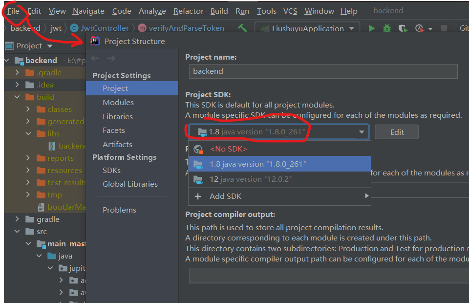
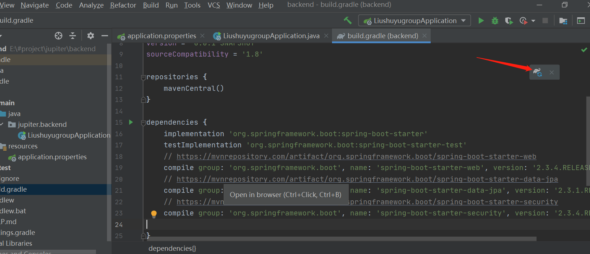

---

---

# Spring Boot

## catalog

## start

### creat project

Go to [click here](https://start.spring.io/) unzip the file, now this file is the project root, use IntelliJ to open it, then a new file called .gradle will be created

Make sure your project is under java 1.8 by check "File - Project Structure" in IntelliJ.

### add dependencies

Add dependencies in build.gradle from [here](https://mvnrepository.com/artifact/org.springframework.boot), dependencies are here:

- `spring-boot-web-starter`: develop base on RESTful services;
- `spring-boot-starter-security`: access-control features;
- `io.jsonwebtoken`: for token;
- `spring-boot-starter-data-jpa`: for relational database access, if we use mongodb, don't include this one;
- `spring-boot-starter-data-mongodb`: for mongo database access;
- `aws-java-sdk`: aws related development.

Every time when you add new dependency, you will have a gradle icon:

click on the icon to load the new dependency.

## annotation

### `@Bean`

To declare a bean, simply annotate a method with the `@Bean` annotation. When JavaConfig encounters such a method, it will execute that method and register the return value as a bean within a `BeanFactory`. By default, the bean name will be the same as the method name. 

[reference here](https://docs.spring.io/spring-javaconfig/docs/1.0.0.M4/reference/html/ch02s02.html)

### `@Component`

`@Component` is the most generic Spring annotation. A Java class decorated with `@Component` is found during classpath scanning and registered in the context as a Spring bean. `@Service`, `@Repository`, and `@Controller` are specializations of `@Component`, which are used for more specific cases.

`@ComponentScan` ensures that the classes decorated with `@Component` are found and registered as Spring beans. `@ComponentScan` is automatically included with `@SpringBootApplication`. 

[reference here](https://zetcode.com/springboot/component/)

## spring boot security

### Libraries

#### `HttpSecurity`

- `cors()`: add `CorsFilter`
- `csrf()``

#### `io.jsonwebtoken`

- [JwtParser](http://javadox.com/io.jsonwebtoken/jjwt/0.4/io/jsonwebtoken/JwtParser.html)
  - [`setSigningKey`](http://javadox.com/io.jsonwebtoken/jjwt/0.4/io/jsonwebtoken/JwtParser.html#setSigningKey-byte:A-)
  - [`parseClaimsJws`](

## Question need to be finished

- what is bean
- what is IoC container